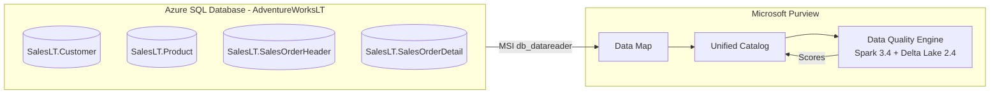

# Microsoft Purview Unified Catalog – Data Quality Tutorial

End-to-end tutorial series implementasi **Microsoft Purview Unified Catalog – Data Quality** menggunakan **Azure SQL Database** dengan sample **AdventureWorksLT**, berbasis dokumentasi resmi [Microsoft Learn](https://learn.microsoft.com/purview/unified-catalog-data-quality).

---

## 📚 Konten

| Resource | Deskripsi |
|----------|-----------|
| 📖 [tutorial-series/](./tutorial-series/) | Tutorial step-by-step (12 modul) — **mulai di sini** |
| 📄 [Tutorial-Demo-Purview-DataQuality-AzureSQL.md](./Tutorial-Demo-Purview-DataQuality-AzureSQL.md) | Versi single-file lengkap (untuk referensi cepat) |

➡️ **Mulai dari** [tutorial-series/README.md](./tutorial-series/README.md)

---

## 🎯 Apa yang Akan Dipelajari

- Provision Azure SQL Database + sample AdventureWorksLT
- Konfigurasi Microsoft Entra Auth & Managed Identity untuk Purview
- Register & scan data source di Purview Data Map
- Membuat Governance Domain & Data Product di Unified Catalog
- Setup Data Quality connection, profiling, rules, dan scan
- Monitoring, actions, alerts, dan health reports

---

## 🏗️ Arsitektur Solusi

---

## 📋 Prasyarat

- Microsoft Entra ID tenant
- Microsoft Purview account aktif di [region yang didukung Data Quality](https://learn.microsoft.com/purview/data-catalog-regions)
- Azure subscription untuk billing DGPU
- Owner/User Access Admin pada subscription/RG
- SSMS atau Azure Data Studio

---

## 🔗 Referensi Utama

- [Overview of data quality in Microsoft Purview Unified Catalog](https://learn.microsoft.com/purview/unified-catalog-data-quality)
- [Discover and govern Azure SQL Database in Microsoft Purview](https://learn.microsoft.com/purview/register-scan-azure-sql-database)
- [Set up data source connection for data quality](https://learn.microsoft.com/purview/unified-catalog-data-quality-supported-sources-connection)
- [Sample setup for data governance](https://learn.microsoft.com/purview/data-governance-setup-sample)

---

## 🤝 Kontribusi

Pull request, issue, dan saran sangat diterima.

## 📜 Lisensi

[MIT License](./LICENSE) — bebas digunakan untuk pembelajaran & demo.

---

> Tutorial ini bukan produk resmi Microsoft. Selalu rujuk [Microsoft Learn](https://learn.microsoft.com/purview/) untuk informasi terbaru.
