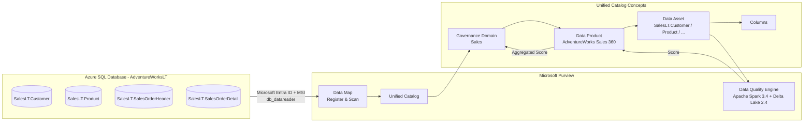
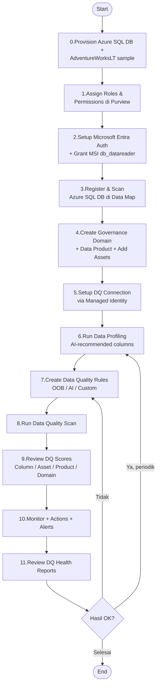
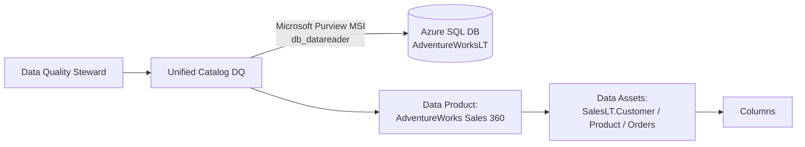
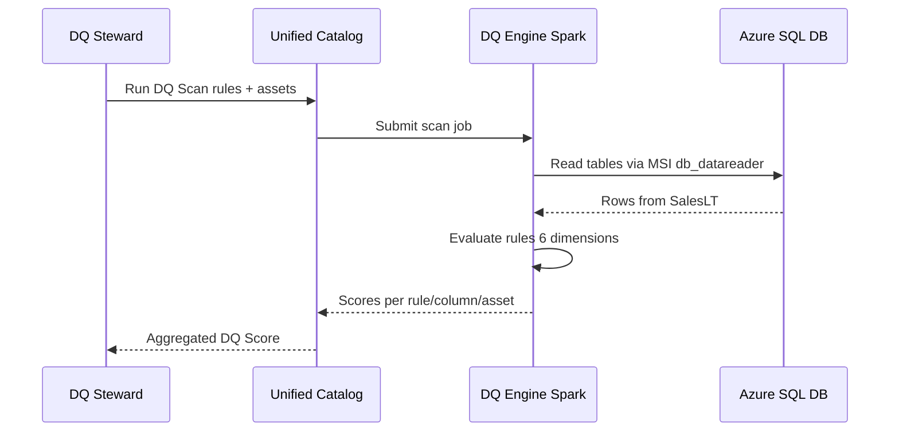
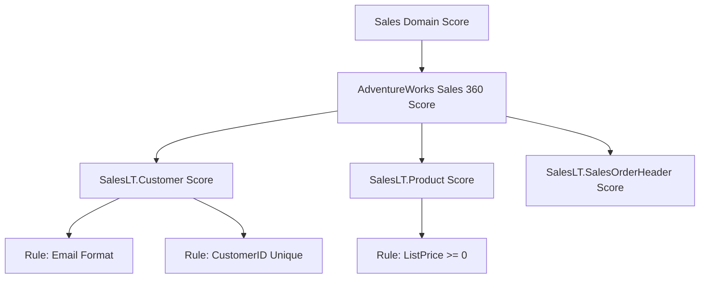

# Tutorial Demo End-to-End: Microsoft Purview Unified Catalog – Data Quality
## Data Source: Azure SQL Database (AdventureWorks / AdventureWorksLT)

> Tutorial ini disusun berdasarkan dokumentasi resmi **Microsoft Learn** untuk Microsoft Purview Unified Catalog – Data Quality, dengan studi kasus **Azure SQL Database** menggunakan sample database **AdventureWorksLT**.
> Tujuan: memandu Anda melakukan demo data quality dari awal (provisioning Azure SQL DB) hingga akhir (monitoring & alerting).

**Referensi utama Microsoft Learn:**
- [Overview of data quality in Microsoft Purview Unified Catalog](https://learn.microsoft.com/purview/unified-catalog-data-quality)
- [Discover and govern Azure SQL Database in Microsoft Purview](https://learn.microsoft.com/purview/register-scan-azure-sql-database)
- [Set up data source connection for data quality](https://learn.microsoft.com/purview/unified-catalog-data-quality-supported-sources-connection)
- [Sample setup for data governance](https://learn.microsoft.com/purview/data-governance-setup-sample)

---

## Daftar Isi

1. [Gambaran Umum & Arsitektur](#1-gambaran-umum--arsitektur)
2. [Prasyarat (Prerequisites)](#2-prasyarat-prerequisites)
3. [Alur Tutorial (High-Level Flow)](#3-alur-tutorial-high-level-flow)
4. [Step 0 – Provisioning Azure SQL Database (AdventureWorksLT)](#step-0--provisioning-azure-sql-database-adventureworkslt)
5. [Step 1 – Setup Roles & Permissions di Purview](#step-1--setup-roles--permissions-di-purview)
6. [Step 2 – Konfigurasi Microsoft Entra Auth di Azure SQL & Berikan Akses MSI](#step-2--konfigurasi-microsoft-entra-auth-di-azure-sql--berikan-akses-msi)
7. [Step 3 – Register & Scan Azure SQL Database di Data Map](#step-3--register--scan-azure-sql-database-di-data-map)
8. [Step 4 – Create Governance Domain & Data Product](#step-4--create-governance-domain--data-product)
9. [Step 5 – Setup Data Quality Connection ke Azure SQL DB](#step-5--setup-data-quality-connection-ke-azure-sql-db)
10. [Step 6 – Run Data Profiling](#step-6--run-data-profiling)
11. [Step 7 – Create Data Quality Rules (AdventureWorks Use-Case)](#step-7--create-data-quality-rules-adventureworks-use-case)
12. [Step 8 – Run Data Quality Scan](#step-8--run-data-quality-scan)
13. [Step 9 – Review Data Quality Scores](#step-9--review-data-quality-scores)
14. [Step 10 – Monitoring, Actions & Alerts](#step-10--monitoring-actions--alerts)
15. [Step 11 – Health Reports](#step-11--health-reports)
16. [Tips, Limitasi, dan Best Practices](#tips-limitasi-dan-best-practices)
17. [Referensi Lengkap](#referensi-lengkap)

---

## 1. Gambaran Umum & Arsitektur

**Microsoft Purview Data Quality** memungkinkan governance domain owner dan data steward menilai serta meningkatkan kualitas data melalui **no-code / low-code rules** (out-of-the-box dan AI-generated). Skor dihitung di level *column → asset → data product → governance domain*.

Pada demo ini, sumber data adalah **Azure SQL Database** dengan sample **AdventureWorksLT** (skema `SalesLT` berisi `Customer`, `Product`, `SalesOrderHeader`, `SalesOrderDetail`, dll.).

### Arsitektur Konseptual



### 6 Dimensi Kualitas Data

| Dimensi | Tujuan |
|---------|--------|
| **Accuracy** | Data merepresentasikan entitas dunia nyata |
| **Completeness** | Tidak ada nilai null/kosong di kolom yang wajib terisi |
| **Conformity** | Data sesuai format standar (email, phone, dll.) |
| **Consistency** | Tidak ada kontradiksi antar nilai pada record yang sama |
| **Timeliness/Freshness** | Data up-to-date sesuai SLA |
| **Uniqueness** | Tidak ada duplikasi pada kolom kunci |

---

## 2. Prasyarat (Prerequisites)

### Lisensi & Akun
- Tenant **Microsoft Entra ID**
- **Microsoft Purview account** aktif di [region yang didukung Data Quality](https://learn.microsoft.com/purview/data-catalog-regions). ⚠️ Pastikan region Purview dan Azure SQL DB **berada di region yang didukung Data Quality** — tidak semua Azure region ter-enable untuk DQ.
- Subscription Azure aktif dengan billing untuk **Data Governance Processing Unit (DGPU)** — pricing lihat [data quality pricing](https://learn.microsoft.com/purview/data-governance-billing#data-quality-pricing)

### Roles yang Dibutuhkan
| Aktivitas | Role |
|-----------|------|
| Mengelola governance domain | **Governance domain owner** |
| Membuat & mengelola data quality rules / scan | **Data Quality Steward** |
| Menjalankan profiling | **Data Profile Steward** |
| Hanya melihat rules | **Data Quality Reader** |
| Melihat health report | **Data Health Reader** |
| Setup auth di Azure SQL | **SQL admin / Microsoft Entra admin** pada SQL Server |
| Role assignment di SQL resource | **Owner** subscription/RG |

> Referensi: [Roles & permissions for Unified Catalog](https://learn.microsoft.com/purview/data-governance-roles-permissions)

### Data Source
- **Azure SQL Database** dengan sample **AdventureWorksLT** terinstal
- **Microsoft Entra (Azure AD) admin** sudah dikonfigurasi pada Azure SQL Server
- **Microsoft Purview Managed Identity (MSI)** dibuat user di database dan diberi role `db_datareader`
- **Networking**: Azure SQL firewall di-set **Allow Azure services and resources to access this server = Yes**, atau gunakan **Managed Virtual Network + Private Endpoint** Purview

> Catatan penting: untuk Data Quality scan pada sumber Microsoft native (Azure SQL, Synapse, SQL MI, ADLS Gen2, Fabric), **hanya Managed Identity** yang didukung — bukan SQL auth atau service principal. Lihat [supported sources](https://learn.microsoft.com/purview/unified-catalog-data-quality-supported-sources-connection).

### Tools Pendukung
- **Azure Portal** untuk provisioning & networking
- **SQL Server Management Studio (SSMS)** atau **Azure Data Studio** untuk menjalankan T-SQL grant

---

## 3. Alur Tutorial (High-Level Flow)



---

## Step 0 – Provisioning Azure SQL Database (AdventureWorksLT)

**Tujuan:** Menyiapkan database sumber yang akan di-govern.

### Langkah

1. Buka [Azure Portal](https://portal.azure.com) → **Create a resource** → **SQL Database**.
2. Isi detail:
   - **Subscription / Resource group**
   - **Database name**: `adventureworks-demo`
   - **Server**: buat baru (misal `sqlsrv-purview-demo`), pilih region yang sama dengan Purview
   - **Authentication method**: **Use Microsoft Entra-only authentication** (recommended) atau **Both SQL & Microsoft Entra**
   - **Set Microsoft Entra admin**: pilih akun admin Anda
   - **Compute + storage**: pilih *Basic / Serverless* untuk demo
3. Tab **Networking**:
   - **Connectivity method**: Public endpoint
   - **Allow Azure services and resources to access this server** → **Yes**
   - Tambahkan **Client IP** Anda agar bisa connect via SSMS
4. Tab **Additional settings** → **Use existing data**: pilih **Sample (AdventureWorksLT)**.
5. **Review + create** → **Create**.
6. Setelah deploy, verifikasi via SSMS / Azure Data Studio:
   ```sql
   SELECT TOP 10 * FROM SalesLT.Customer;
   SELECT COUNT(*) FROM SalesLT.Product;
   ```

> ℹ️ **Catatan tentang sample data:**
> - Azure Portal hanya menyediakan opsi **AdventureWorksLT** (versi ringkas dengan skema `SalesLT`).
> - Untuk **AdventureWorks** versi lengkap (`Sales`, `HumanResources`, `Production`, dll.), deploy manual menggunakan BACPAC/script dari [SQL Server samples (GitHub)](https://github.com/microsoft/sql-server-samples/tree/master/samples/databases).
> - Tanggal data sample berkisar **tahun 2005–2008**, sehingga rule **Freshness** dengan threshold sekarang akan **selalu fail** — ini justru cocok untuk demo skenario remediation.

> Referensi: [Quickstart: Create an Azure SQL Database single database](https://learn.microsoft.com/azure/azure-sql/database/single-database-create-quickstart)

---

## Step 1 – Setup Roles & Permissions di Purview

**Tujuan:** Memastikan user demo memiliki izin yang sesuai pada governance domain Purview.

### Langkah

1. Buka [Microsoft Purview portal](https://purview.microsoft.com).
2. Pilih **Settings** → **Roles and permissions** → **Governance domain roles**.
3. Pilih atau buat governance domain (misal `Sales`).
4. Tambahkan user demo ke role berikut:
   - `Governance domain owner`
   - `Data quality steward`
   - `Data profile steward`
   - `Data health reader`
5. **Save**.

> Detail: [How to assign governance domain roles](https://learn.microsoft.com/purview/data-governance-roles-permissions#how-to-assign-governance-domain-roles)

---

## Step 2 – Konfigurasi Microsoft Entra Auth di Azure SQL & Berikan Akses MSI

**Tujuan:** Membuat user untuk **Microsoft Purview Managed Identity (MSI)** di Azure SQL Database dan memberinya `db_datareader` (syarat wajib untuk scan & DQ).

### 2.1 Cek nama Managed Identity Purview
1. Buka Azure Portal → akun Microsoft Purview Anda.
2. Tab **Properties** → catat **Managed identity object ID** dan nama akun (nama akun = nama SAMI).

### 2.2 Berikan role `Reader` di Azure SQL Server (Azure RBAC)
1. Pada **SQL Server** (bukan database) → **Access control (IAM)** → **+ Add role assignment**.
2. **Role**: `Reader`. **Assign access to**: pilih **Managed identity** → Microsoft Purview account / UAMI.
3. **Save**.

### 2.3 Buat user MSI di database & grant `db_datareader`
Connect ke Azure SQL DB sebagai **Microsoft Entra admin** (gunakan SSMS / Azure Data Studio), lalu jalankan pada database `adventureworks-demo`:

```sql
-- Ganti [PurviewAccountName] dengan nama akun Microsoft Purview Anda
CREATE USER [PurviewAccountName] FROM EXTERNAL PROVIDER;
GO

EXEC sp_addrolemember 'db_datareader', [PurviewAccountName];
GO
```

> Verifikasi:
> ```sql
> SELECT name, type_desc FROM sys.database_principals WHERE name = 'PurviewAccountName';
> ```

> Referensi:
> - [Configure authentication for a scan – Azure SQL DB](https://learn.microsoft.com/purview/register-scan-azure-sql-database#configure-authentication-for-a-scan)
> - [Grant Microsoft Purview permissions on the source](https://learn.microsoft.com/purview/unified-catalog-data-quality-supported-sources-connection#grant-microsoft-purview-permissions-on-the-source)

---

## Step 3 – Register & Scan Azure SQL Database di Data Map

**Tujuan:** Mendaftarkan & meng-cataloging metadata Azure SQL DB ke Purview.

### Langkah

1. Di Purview portal → **Data Map** → **Sources** → **Register**.
2. Pilih **Azure SQL Database** → isi:
   - **Name**: `aw-sqldb-demo`
   - **Subscription / Server name / Database**
   - **Collection** target
3. **Register**.
4. Pada source yang sudah terdaftar → **New scan**.
5. **Credential**: pilih **Microsoft Purview MSI (system-assigned)**.
   > Otorisasi sudah disiapkan pada **Step 2**.
6. **Test connection** → harus **Success**.
7. Pilih scope (semua tables `SalesLT.*` untuk demo).
8. Pilih **Scan rule set** (System default sudah cukup).
9. **Scan trigger**: **Once**.
10. **Save and run**.
11. Tunggu hingga status **Succeeded** → asset (`SalesLT.Customer`, `SalesLT.Product`, dll.) akan muncul di Unified Catalog.

> Referensi: [Discover and govern Azure SQL Database in Microsoft Purview](https://learn.microsoft.com/purview/register-scan-azure-sql-database)

---

## Step 4 – Create Governance Domain & Data Product

**Tujuan:** Mengelompokkan asset SQL ke dalam *data product* yang dapat di-govern.

### Langkah

1. Buka **Unified Catalog** → **Governance domains**.
2. **+ New** → buat domain `Sales` (jika belum ada).
3. Masuk ke domain → tab **Data products** → **+ New data product**.
4. Isi:
   - **Name**: `AdventureWorks Sales 360`
   - **Type**: *Operational* (atau *Master/Reference*)
   - **Owners** & **Description**
5. Buka data product yang baru dibuat → **Data assets** → **+ Add data assets**.
6. Cari & tambahkan asset hasil scan:
   - `SalesLT.Customer`
   - `SalesLT.Product`
   - `SalesLT.SalesOrderHeader`
   - `SalesLT.SalesOrderDetail`
7. Submit/publish data product.

> Referensi: [Add and remove data assets to a data product](https://learn.microsoft.com/purview/unified-catalog-data-products-create-manage#add-and-remove-data-assets)

---

## Step 5 – Setup Data Quality Connection ke Azure SQL DB

**Tujuan:** Memberi izin Purview DQ engine membaca data Azure SQL secara fisik untuk profiling & scanning.

### Langkah

1. Di Unified Catalog → **Health management** → **Data quality**.
2. Pilih governance domain `Sales`.
3. **Manage** → **Connections** → **+ New**.
4. Isi:
   - **Display name**: `AdventureWorks Azure SQL DQ`
   - **Description**: `DQ connection ke AdventureWorksLT`
   - **Source type**: **Azure SQL Database**
   - **Subscription / Server name / Database name** (`adventureworks-demo`)
   - **Credential**: **Microsoft Purview MSI** (wajib — satu-satunya yang didukung untuk DQ)
5. Klik **Test connection**.
6. Setelah sukses → **Submit**.

> Jika koneksi gagal:
> - Pastikan firewall Azure SQL Server **Allow Azure services = Yes**, atau gunakan **Managed VNet + Private Endpoint** Purview.
> - Pastikan user MSI ada di database dan ber-role `db_datareader` (Step 2.3).

> Referensi: [Set up data source connection for data quality](https://learn.microsoft.com/purview/unified-catalog-data-quality-supported-sources-connection)

### Diagram Hubungan



---

## Step 6 – Run Data Profiling

**Tujuan:** Memahami statistik & distribusi tiap kolom sebelum membuat rules.

### Langkah

1. Health management → **Data quality** → pilih `Sales` → pilih `AdventureWorks Sales 360` → pilih asset `SalesLT.Customer`.
2. Buka tab **Overview** asset → klik **Profile**.
3. AI recommendation engine akan menyarankan kolom-kolom penting (misal `EmailAddress`, `Phone`, `FirstName`, `LastName`).
4. Pilih kolom (max **50 kolom per batch**). Hindari kolom yang sepenuhnya unique seperti `CustomerID` (PK) untuk profiling distribusi.
5. Klik **Run Profile**.
6. Pantau status di **Job monitoring** page.
7. Setelah selesai → buka tab **Profile** untuk melihat:
   - Distribution
   - Min / Max / Std Dev
   - Uniqueness, Completeness
   - Duplicate count
   - Sample values
8. Ulangi untuk asset lain (`SalesLT.Product`, `SalesOrderHeader`, dst).

> Referensi: [Configure and run data profiling](https://learn.microsoft.com/purview/unified-catalog-data-quality-profiling)

> ⚠️ **Catatan:**
> - Jika schema database berubah → **Import schema** sebelum re-profile.
> - Profiling pada Azure SQL berjalan via Spark + JDBC pull, jadi memerlukan koneksi network ke SQL Server.

---

## Step 7 – Create Data Quality Rules (AdventureWorks Use-Case)

**Tujuan:** Menentukan ekspektasi kualitas data berdasarkan hasil profiling.

### Pilihan Tipe Rule
- **Out-of-the-box (OOB)** — Empty/blank, Data type match, Uniqueness, Range, Pattern (regex), Freshness
- **AI-generated** — Purview menyarankan rule berdasarkan profile
- **Custom** — gunakan ekspresi & function library

### Contoh Rules untuk Demo AdventureWorksLT

| # | Asset | Kolom | Tipe Rule | Dimensi | Deskripsi |
|---|-------|-------|-----------|---------|-----------|
| 1 | `SalesLT.Customer` | `EmailAddress` | Pattern (regex) | Conformity | Harus format email valid `^[\w\.-]+@[\w\.-]+\.\w+$` |
| 2 | `SalesLT.Customer` | `EmailAddress` | Empty/blank | Completeness | Tidak boleh null |
| 3 | `SalesLT.Customer` | `CustomerID` | Uniqueness | Uniqueness | Tidak ada duplikasi PK |
| 4 | `SalesLT.Customer` | `Phone` | Pattern | Conformity | Sesuai format telepon (set threshold longgar; di sample banyak baris null) |
| 5 | `SalesLT.Product` | `ListPrice` | Range / Custom expression | Accuracy | `ListPrice >= 0` dan `ListPrice >= StandardCost` |
| 6 | `SalesLT.Product` | `SellEndDate` | Freshness / Custom | Timeliness | Bila tidak null, `SellEndDate >= SellStartDate` |
| 7 | `SalesLT.Product` | `ProductNumber` | Uniqueness | Uniqueness | Unik per product |
| 8 | `SalesLT.SalesOrderHeader` | `OrderDate` | Freshness (table-level) | Timeliness | Order terbaru dalam 24 jam (SLA demo) |
| 9 | `SalesLT.SalesOrderHeader` | `TotalDue` | Custom | Consistency | `TotalDue = SubTotal + TaxAmt + Freight` |
| 10 | `SalesLT.SalesOrderDetail` | `OrderQty` | Range | Accuracy | `OrderQty > 0` |

### Langkah Membuat Rule (contoh untuk EmailAddress)

1. Buka data asset `SalesLT.Customer` → tab **Rules** → **+ New rule**.
2. Pilih jenis rule **Pattern matching** (atau **Empty/blank fields** untuk rule completeness).
3. Pilih kolom dari dropdown: `EmailAddress`.
4. Beri nama rule: `Customer Email Format Valid`.
5. Masukkan regex pattern.
6. (Opsional) Tetapkan **threshold** skor minimum (mis. 95%).
7. Klik **Create**.
8. Ulangi untuk semua rule pada tabel.

> Referensi: [Create data quality rules](https://learn.microsoft.com/purview/unified-catalog-data-quality-rules)

---

## Step 8 – Run Data Quality Scan

**Tujuan:** Mengevaluasi data terhadap rules dan menghasilkan skor.

### Langkah

1. Pada data product `AdventureWorks Sales 360` → klik **Run data quality scan**.
2. Pilih asset & rules yang akan diaplikasikan.
3. (Opsional) **Schedule** scan: hourly / daily / weekly / monthly.
4. **Submit**.
5. Pantau status dari **Job monitoring**.



> Referensi: [Configure and run a data quality scan](https://learn.microsoft.com/purview/unified-catalog-data-quality-scan)

---

## Step 9 – Review Data Quality Scores

**Tujuan:** Menafsirkan skor kualitas pada beberapa level agregasi.

### Level Skor



### Langkah

1. Buka governance domain `Sales` → lihat **DQ score keseluruhan**.
2. Drill down ke `AdventureWorks Sales 360` → asset → kolom.
3. Pada tab **Rules**, klik rule untuk melihat **performance history** (mis. trend skor email format selama 30 hari).
4. Identifikasi rule/kolom yang underperform untuk diteruskan ke remediation.

> Referensi: [Data quality scores](https://learn.microsoft.com/purview/unified-catalog-data-quality-scores)

---

## Step 10 – Monitoring, Actions & Alerts

### A. Job Monitoring
- Health management → **Data quality** → **Monitoring**.
- Filter status: *Active*, *Completed*, *Failed*.
- Lihat history scanning untuk audit.

> Referensi: [Job monitoring](https://learn.microsoft.com/purview/unified-catalog-data-quality-job-monitor)

### B. Data Quality Actions
- Buka **Actions Center** untuk daftar anomali kualitas data.
- Setiap action menyediakan **diagnostic query** sehingga steward bisa langsung melihat baris bermasalah, contoh:
  ```sql
  SELECT CustomerID, EmailAddress
  FROM SalesLT.Customer
  WHERE EmailAddress NOT LIKE '%_@__%.__%';
  ```

> Referensi: [Data quality actions](https://learn.microsoft.com/purview/unified-catalog-data-quality-actions)

### C. Alerts / Notifications
1. Buka rule → **Alerts** → **+ New alert**.
2. Set **threshold** (mis: alert jika skor `Customer Email Format Valid` < 95%).
3. Tambahkan **email** atau **distribution group** penerima.
4. Save.

> Referensi: [Data quality alerts](https://learn.microsoft.com/purview/unified-catalog-data-quality-alerts)

---

## Step 11 – Health Reports

**Tujuan:** Visualisasi tren kualitas data untuk komunikasi ke stakeholder.

### Langkah

1. Unified Catalog → **Health management** → **Reports**.
2. Pilih **DQ health** report.
3. Tab yang tersedia:
   - **Overview** — ringkasan skor per domain
   - **Details** — jumlah rules per data product/asset/CDE
   - **Historical Trend** — tren 13 bulan terakhir, top/bottom 10 assets
4. Filter berdasarkan governance domain `Sales` & data product `AdventureWorks Sales 360`.

> Catatan: report bergantung pada **data health controls** dan **Unified Catalog metadata self-serve analytics**.

> Referensi: [Understand the quality report](https://learn.microsoft.com/purview/unified-catalog-reports-data-quality-health)

---

## Tips, Limitasi, dan Best Practices

### Best Practices
- ✅ Mulai dengan **subset kecil** kolom kritikal (mis. `EmailAddress`, `ListPrice`) sebelum scaling ke seluruh schema.
- ✅ Gunakan **AI-recommended rules** untuk akselerasi adopsi awal.
- ✅ Pasang **freshness rule** di table-level (`SalesOrderHeader.OrderDate`) untuk SLA monitoring.
- ✅ Set **alert threshold** sesuai business criticality.
- ✅ Lakukan **Import schema** + **re-profile** setelah perubahan skema database.
- ✅ Gunakan **UAMI (User-Assigned Managed Identity)** untuk environment multi-Purview agar lebih portable.
- ✅ Iterasi berkala — DQ adalah continuous improvement.

### Limitasi yang Perlu Diketahui
| Item | Detail |
|------|--------|
| Credential untuk DQ pada Azure SQL | **Hanya Managed Identity** (SAMI/UAMI). SQL auth & service principal **tidak didukung** untuk DQ scan |
| Self-hosted Integration Runtime | **Tidak mendukung** SAMI/UAMI untuk Azure SQL — gunakan SQL auth atau SP (hanya untuk discovery, bukan DQ) |
| Profiling batch | Maks **50 kolom** per batch |
| Engine | Apache **Spark 3.4** + Delta Lake **2.4** |
| Network | Azure SQL firewall harus mengizinkan trusted Azure services, atau gunakan **Managed VNet** Purview |
| Region | Hanya region yang [didukung](https://learn.microsoft.com/purview/data-catalog-regions) |
| Private endpoint Purview | Saat menggunakan private endpoint untuk Purview, MSI **tidak didukung** untuk registrasi sumber |

### Pricing
DGPU pay-as-you-go — perkirakan biaya berdasarkan jumlah kolom × frekuensi scan. Lihat [data governance billing](https://learn.microsoft.com/purview/data-governance-billing#data-quality-pricing).

### Keamanan & Data Residency
- Metadata & profiling summary disimpan di Microsoft Managed Storage **dalam region yang sama** dengan data source → data residency terjaga.
- Semua data dienkripsi. Untuk kontrol lebih, gunakan [Microsoft Purview Customer Key (CMK)](https://learn.microsoft.com/purview/customer-key-overview).
- Purview hanya butuh **read-level** (`db_datareader`) untuk discovery, profiling, dan DQ scan.

---

## Referensi Lengkap

| Topik | Link |
|-------|------|
| Overview Data Quality | https://learn.microsoft.com/purview/unified-catalog-data-quality |
| Discover & govern Azure SQL Database | https://learn.microsoft.com/purview/register-scan-azure-sql-database |
| DQ source connection | https://learn.microsoft.com/purview/unified-catalog-data-quality-supported-sources-connection |
| Get started with Purview Data Governance | https://learn.microsoft.com/purview/data-governance-get-started |
| Sample setup for data governance | https://learn.microsoft.com/purview/data-governance-setup-sample |
| Roles & permissions | https://learn.microsoft.com/purview/data-governance-roles-permissions |
| Register data source | https://learn.microsoft.com/purview/data-map-data-sources-register-manage |
| Scan data sources | https://learn.microsoft.com/purview/data-map-scan-data-sources |
| Credentials for source authentication | https://learn.microsoft.com/purview/data-map-data-scan-credentials |
| Manage data products | https://learn.microsoft.com/purview/unified-catalog-data-products-create-manage |
| Data profiling | https://learn.microsoft.com/purview/unified-catalog-data-quality-profiling |
| Create DQ rules | https://learn.microsoft.com/purview/unified-catalog-data-quality-rules |
| Run DQ scan | https://learn.microsoft.com/purview/unified-catalog-data-quality-scan |
| DQ scores | https://learn.microsoft.com/purview/unified-catalog-data-quality-scores |
| Job monitoring | https://learn.microsoft.com/purview/unified-catalog-data-quality-job-monitor |
| DQ actions | https://learn.microsoft.com/purview/unified-catalog-data-quality-actions |
| DQ alerts | https://learn.microsoft.com/purview/unified-catalog-data-quality-alerts |
| DQ health reports | https://learn.microsoft.com/purview/unified-catalog-reports-data-quality-health |
| Managed virtual network | https://learn.microsoft.com/purview/unified-catalog-data-quality-managed-virtual-networks |
| Data Quality REST API (preview) | https://learn.microsoft.com/rest/api/purview/unified-catalog-data-quality |
| Pricing (DGPU) | https://learn.microsoft.com/purview/data-governance-billing#data-quality-pricing |
| Customer Key (CMK) | https://learn.microsoft.com/purview/customer-key-overview |
| Quickstart Azure SQL DB | https://learn.microsoft.com/azure/azure-sql/database/single-database-create-quickstart |
| Microsoft Entra auth Azure SQL | https://learn.microsoft.com/azure/azure-sql/database/authentication-aad-configure |
| Service principal user di Azure SQL | https://learn.microsoft.com/azure/azure-sql/database/authentication-aad-service-principal-tutorial |
| Supported regions | https://learn.microsoft.com/purview/data-catalog-regions |

---

> **Selamat mencoba demo!** Setelah berhasil dengan Azure SQL Database (AdventureWorksLT), Anda dapat mereplikasi pola yang sama pada **Azure SQL Managed Instance**, **Synapse Dedicated/Serverless**, **Fabric Lakehouse**, atau **Snowflake** dengan referensi Microsoft Learn pada tabel di atas.
