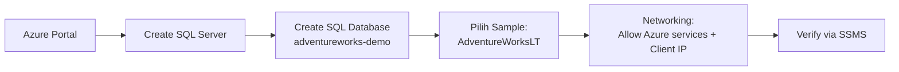

# Modul 00 – Provisioning Azure SQL Database (AdventureWorksLT)

> **Tujuan:** Menyiapkan database sumber yang akan di-govern oleh Microsoft Purview.

⏱️ **Estimasi:** 15 menit · 🎯 **Output:** Azure SQL Database `adventureworks-demo` aktif berisi sample `SalesLT.*`

---

## 📖 Penjelasan Singkat

**Azure SQL Database** adalah PaaS relational database dari Microsoft. Kita akan menggunakan sample **AdventureWorksLT** (Lightweight) yang berisi data toko sepeda dengan skema `SalesLT`. Sample ini cocok untuk demo karena:
- Sudah disediakan langsung di Azure Portal (1-click).
- Berisi tabel realistis: `Customer`, `Product`, `SalesOrderHeader`, `SalesOrderDetail`.
- Cukup ringan untuk skema demo, tetapi cukup beragam untuk menguji rules.

> ℹ️ **AdventureWorksLT vs AdventureWorks:** Versi lengkap (`Sales`, `HumanResources`, `Production`, dll.) **tidak disediakan** lewat portal — bila perlu, deploy manual dari [SQL Server samples (GitHub)](https://github.com/microsoft/sql-server-samples/tree/master/samples/databases). Untuk tutorial ini, **LT sudah cukup**.

---

## 🧭 Diagram



---

## 🚀 Langkah-langkah

### 1. Buat SQL Database
1. Buka [Azure Portal](https://portal.azure.com) → **Create a resource** → **SQL Database**.
2. Isi tab **Basics**:
   - **Subscription / Resource group**: pilih atau buat baru
   - **Database name**: `adventureworks-demo`
   - **Server**: **Create new** → nama unik (misal `sqlsrv-purview-demo`), pilih region **yang sama** dengan Purview
   - **Authentication method**: **Use Microsoft Entra-only authentication** (recommended) atau **Both**
   - **Set Microsoft Entra admin**: pilih akun Anda
   - **Compute + storage**: pilih *Basic / Serverless* untuk hemat biaya demo

### 2. Konfigurasi Networking
Tab **Networking**:
- **Connectivity method**: **Public endpoint**
- **Allow Azure services and resources to access this server** → **Yes** ✅ (penting agar Purview MSI bisa connect)
- **Add current client IP address** → **Yes** (agar Anda bisa connect via SSMS)

### 3. Pilih Sample Data
Tab **Additional settings**:
- **Use existing data** → **Sample**
- Otomatis terpilih **AdventureWorksLT**

### 4. Deploy
- **Review + create** → **Create**
- Tunggu deployment selesai (~3 menit).

### 5. Verifikasi
Connect via **SSMS** atau **Azure Data Studio** menggunakan akun **Microsoft Entra admin**, lalu jalankan:

```sql
SELECT TOP 10 * FROM SalesLT.Customer;
SELECT COUNT(*) AS TotalProducts FROM SalesLT.Product;
SELECT COUNT(*) AS TotalOrders FROM SalesLT.SalesOrderHeader;
```

Output yang diharapkan: ada baris data, total product ~295, total order ~32.

---

## ⚠️ Hal yang Perlu Diperhatikan

| Item | Catatan |
|------|---------|
| Region | Pilih region yang **sama** dengan akun Purview agar latency rendah & data residency konsisten |
| Tanggal sample | Data berkisar **2005–2008** → freshness rule 24 jam akan **selalu fail** (justru bagus untuk demo skenario remediation) |
| Firewall | Bila menggunakan corporate network, IP outbound bisa berubah — pastikan whitelist client IP up-to-date |
| Cost | *Basic tier* ≈ < $5/bulan; matikan/delete database setelah demo |

---

## ✅ Checkpoint

- [ ] SQL Server `sqlsrv-purview-demo` aktif
- [ ] Database `adventureworks-demo` ter-deploy dengan sample data
- [ ] Microsoft Entra admin sudah di-set
- [ ] Bisa query `SELECT TOP 10 * FROM SalesLT.Customer` via SSMS

---

## 🔗 Referensi

- [Quickstart: Create an Azure SQL Database single database](https://learn.microsoft.com/azure/azure-sql/database/single-database-create-quickstart)
- [Configure Microsoft Entra authentication with Azure SQL](https://learn.microsoft.com/azure/azure-sql/database/authentication-aad-configure)
- [AdventureWorks sample databases](https://learn.microsoft.com/sql/samples/adventureworks-install-configure)

---

⬅️ [README](./README.md) · ➡️ [Modul 01 – Setup Roles & Permissions](./01-setup-roles-permissions.md)
