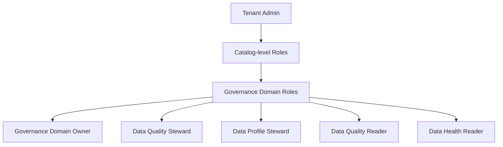

# Modul 01 – Setup Roles & Permissions di Purview

> **Tujuan:** Memastikan user demo memiliki izin yang sesuai untuk mengelola Data Quality di Unified Catalog.

⏱️ **Estimasi:** 10 menit · 🎯 **Output:** Akun demo memiliki role steward yang dibutuhkan

---

## 📖 Penjelasan Singkat

Microsoft Purview Unified Catalog menggunakan model **role-based access control (RBAC)** berlapis:
- **Tenant-level roles** — administrasi global
- **Catalog-level roles** — akses lintas governance domain
- **Governance domain–level roles** — akses spesifik per domain (yang akan kita pakai)

Untuk demo Data Quality, user demo minimal harus jadi **Data Quality Steward** + **Data Profile Steward** pada governance domain yang akan digunakan. Tanpa role ini, opsi *Profile*, *Rules*, dan *Run scan* **tidak akan muncul** di portal.

---

## 🧭 Hierarki Role

---

## 🎭 Role yang Dibutuhkan untuk Demo

| Role | Untuk Apa |
|------|-----------|
| **Governance domain owner** | Membuat domain & data product |
| **Data quality steward** | Membuat & menjalankan rules + scan |
| **Data profile steward** | Menjalankan profiling job |
| **Data health reader** | Melihat dashboard & health report |
| (Opsional) **Data quality reader** | Untuk audience read-only |

---

## 🚀 Langkah-langkah

### 1. Buka Purview Portal
1. Login ke [https://purview.microsoft.com](https://purview.microsoft.com).
2. Pastikan tenant yang aktif benar (kanan atas).

### 2. Akses Role Management
1. Klik **Settings** (ikon gear, kanan atas).
2. Di panel **Settings**, di bawah grup **Microsoft Purview**, pilih **Roles and scopes**.
3. Pada halaman *Roles and scopes*, pilih **Governance domains** (atau **Data governance** → **Governance domains**, tergantung versi UI).

> Sebagai alternatif, Anda bisa buka **Unified Catalog** → **Governance domains** → pilih domain → tab **Roles**. Hasilnya sama.

### 3. Buat / Pilih Governance Domain
> Bila domain `Sales` belum ada, biarkan dulu — akan dibuat di **Modul 04**. Untuk demo cepat, Anda bisa pakai domain default atau buat sementara.

1. Pilih atau buat domain `Sales`.
2. Buka tab **Roles**.

### 4. Tambah User ke Role
Untuk **setiap role berikut**, klik **Edit** → tambahkan user/group demo Anda → **Save**:
- ✅ Governance domain owner
- ✅ Data quality steward
- ✅ Data profile steward
- ✅ Data health reader

### 5. Verifikasi
1. Logout & login ulang (refresh token).
2. Buka **Unified Catalog** → **Health management** → **Data quality**.
3. Anda harus dapat melihat tombol **Manage**, **Profile**, dan **+ New rule** ketika navigasi ke asset.

---

## ⚠️ Hal yang Perlu Diperhatikan

| Item | Catatan |
|------|---------|
| Propagasi role | Bisa butuh **5–15 menit** untuk efektif — lakukan refresh atau re-login |
| Group vs user | Untuk produksi, gunakan **Microsoft Entra Group** agar lebih mudah dikelola |
| Least privilege | Berikan steward role hanya pada domain yang relevan, jangan tenant-wide |

---

## ✅ Checkpoint

- [ ] User demo memiliki minimal 4 role di domain target
- [ ] Bisa melihat halaman **Health management → Data quality**
- [ ] Bisa membuka **Manage → Connections** (button visible)

---

## 🔗 Referensi

- [Roles & permissions for Microsoft Purview Unified Catalog](https://learn.microsoft.com/purview/data-governance-roles-permissions)
- [How to assign governance domain roles](https://learn.microsoft.com/purview/data-governance-roles-permissions#how-to-assign-governance-domain-roles)
- [How to assign catalog-level roles](https://learn.microsoft.com/purview/data-governance-roles-permissions#how-to-assign-catalog-level-roles)

---

⬅️ [Modul 00](./00-provisioning-azure-sql.md) · ➡️ [Modul 02 – Microsoft Entra Auth & MSI](./02-configure-entra-auth-msi.md)
