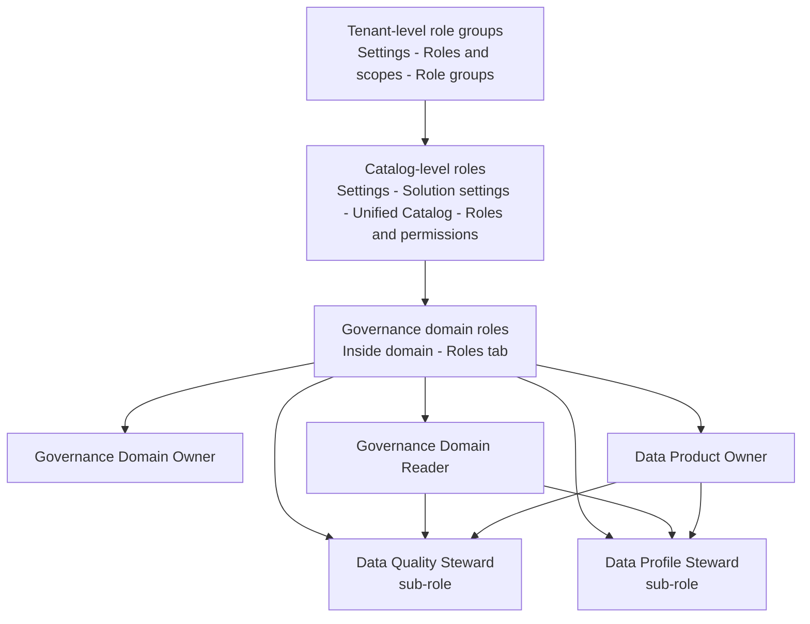

# Modul 01 – Setup Roles & Permissions di Purview

> **Tujuan:** Memastikan user demo memiliki izin yang sesuai untuk mengelola Data Quality di Microsoft Purview Unified Catalog.

⏱️ **Estimasi:** 10–15 menit · 🎯 **Output:** Akun demo memiliki kombinasi role yang dibutuhkan untuk profiling, rules, dan DQ scan

---

## 📖 Penjelasan Singkat

Microsoft Purview data governance memakai **3 lapis permission** (sesuai [Microsoft Learn](https://learn.microsoft.com/purview/data-governance-roles-permissions)):

| Lapis | Kelola di | Contoh role |
|-------|-----------|-------------|
| **Tenant-level role groups** | Microsoft Purview Compliance Portal (Settings → Roles and scopes → Role groups) | Purview Administrators, Data Source Administrators, Data Governance |
| **Catalog-level roles** | Settings → **Solution settings** → **Unified Catalog** → **Roles and permissions** | Governance Domain Creator, Data Health Owner, Data Health Reader, Global Catalog Reader |
| **Governance domain–level roles** | Di dalam domain → tab **Roles** | Governance Domain Owner, Data Product Owner, Data Steward, Data Quality Steward, Data Profile Steward, dll. |

Untuk demo Data Quality, fokus utama ada di **lapis ke-3 (governance domain–level)** — karena di sanalah `Data Quality Steward` dan `Data Profile Steward` di-assign.

> ⚠️ **Penting:** `Data Quality Steward` dan `Data Profile Steward` adalah **sub-role**. Keduanya **wajib dikombinasikan** dengan role induk **`Governance Domain Reader` + `Data Product Owner`** agar tombol *Profile*, *Rules*, dan *Run scan* aktif di portal.

---

## 🧭 Hierarki Role

---

## 🎭 Role yang Dibutuhkan untuk Demo DQ

| Role | Lapis | Untuk Apa | Wajib? |
|------|-------|-----------|--------|
| **Governance Domain Creator** | Catalog | Membuat governance domain baru | ✅ untuk owner demo |
| **Governance Domain Owner** | Domain | Membuat & manage data product, assign role lain di domain | ✅ |
| **Data Product Owner** | Domain | Membuat data product, link assets | ✅ |
| **Governance Domain Reader** | Domain | Prasyarat sub-role steward & reader | ✅ |
| **Data Quality Steward** *(sub-role)* | Domain | Membuat & menjalankan rules + DQ scan | ✅ |
| **Data Profile Steward** *(sub-role)* | Domain | Menjalankan profiling job | ✅ |
| **Data Health Reader** | Catalog | Melihat dashboard health management | Opsional |
| **Data Quality Reader** *(sub-role)* | Domain | Audience read-only untuk insight DQ | Opsional |

---

## 🚀 Langkah-langkah

### 1. Buka Purview Portal
1. Login ke [https://purview.microsoft.com](https://purview.microsoft.com).
2. Pastikan tenant aktif benar (cek avatar kanan atas).
3. Pastikan akun login sudah memiliki **Data Governance Administrator** atau **Purview Administrators** role group (jika belum, minta tenant admin).

### 2. (Catalog level) Assign Governance Domain Creator
> Lewati step ini jika user demo Anda sudah punya role tersebut.

1. Klik **Settings** (ikon gear di **left side-nav**, posisi bawah).
2. Halaman pertama akan memunculkan **Account overview**. Di sidebar Settings, scroll ke bagian **Solution settings**, lalu klik **Unified Catalog**.
3. Pada halaman Unified Catalog, pilih **Roles and permissions**.
4. Pilih role **Governance Domain Creator** → klik ikon **+ Add user**.
5. Cari user demo → **Save**.
6. (Opsional) ulangi untuk **Data Health Reader** / **Data Health Owner** bila demo perlu akses Health management lintas domain.

> 💡 **Shortcut:** Bila tenant Anda sudah enable Unified Catalog, side-nav kiri akan menampilkan icon **Unified Catalog** langsung — bisa diklik untuk membuka catalog tanpa lewat **Solutions**.

> 🔍 **Tidak menemukan menu "Unified Catalog" di Settings?**
> Tenant Anda belum di-provision untuk Unified Catalog. Cek bahwa:
> - DGPU billing sudah aktif (lihat [billing](https://learn.microsoft.com/purview/data-governance-billing)).
> - Region Purview termasuk [supported region](https://learn.microsoft.com/purview/data-catalog-regions) — di **Settings → Account** Anda dapat melihat *Location* resource Purview.
> - **Account type** = **Enterprise** (cek di Settings → Account overview). Free tier tidak punya Unified Catalog.
> - Solutions panel menampilkan **Unified Catalog** (bukan hanya **Data Catalog** classic).

### 3. (Catalog level) Buat Governance Domain
Modul lengkapnya ada di **[Modul 04](./04-create-governance-domain-data-product.md)**, tapi minimal harus ada satu domain dulu agar bisa assign role domain.

1. Buka **Unified Catalog** dari **left side-nav** (icon Unified Catalog), atau lewat **Solutions → Unified Catalog**.
2. Pilih **Governance domains** → **+ New governance domain**.
3. Beri nama mis. `Sales`, type `Line of business` → **Save**.
4. Klik domain → **Publish** (status harus *Published* sebelum bisa dipakai).

### 4. (Domain level) Assign Role di dalam Domain
1. Buka domain `Sales` yang barusan dibuat.
2. Klik tab **Roles**.
3. Untuk **setiap role berikut**, klik **Edit** → tambahkan user/group demo → **Save**:
   - ✅ Governance Domain Owner
   - ✅ Data Product Owner
   - ✅ Governance Domain Reader *(prasyarat sub-role)*
   - ✅ Data Quality Steward *(sub-role)*
   - ✅ Data Profile Steward *(sub-role)*
   - (Opsional) Data Quality Reader — untuk audience read-only

### 5. Verifikasi
1. Logout & login ulang ke [https://purview.microsoft.com](https://purview.microsoft.com) (refresh token).
2. Klik **Unified Catalog** di left side-nav → buka **Health management** → **Data quality**.
3. Anda harus dapat melihat tombol **Manage**, **Profile**, dan **+ New rule** ketika navigasi ke asset di domain.

---

## ⚠️ Hal yang Perlu Diperhatikan

| Item | Catatan |
|------|---------|
| Propagasi role | Butuh **5–15 menit** efektif — refresh atau re-login |
| Sub-role tidak berdiri sendiri | Data Quality/Profile Steward & Reader **wajib digabung** dengan Governance Domain Reader + Data Product Owner |
| Group vs user | Untuk produksi pakai **Microsoft Entra Group** agar mudah dikelola |
| Tenant tanpa Unified Catalog | Kalau Solutions hanya menampilkan **Data Catalog** classic, fitur Data Quality tidak tersedia — perlu enable Unified Catalog & DGPU billing |
| Tenant-level role groups | Kelola via **Settings → Roles and scopes → Role groups** (Compliance portal) — terpisah dari Unified Catalog roles |
| Least privilege | Berikan steward role hanya pada domain yang relevan, jangan tenant-wide |

---

## ✅ Checkpoint

- [ ] User demo punya **Governance Domain Creator** (catalog level)
- [ ] Domain `Sales` sudah dibuat & **Published**
- [ ] User demo punya semua role wajib di tab **Roles** domain
- [ ] Bisa melihat halaman **Health management → Data quality**
- [ ] Bisa membuka **Manage → Connections** (button visible) di Data quality

---

## 🔗 Referensi

- [Roles & permissions for Microsoft Purview data governance](https://learn.microsoft.com/purview/data-governance-roles-permissions)
- [How to assign catalog-level roles](https://learn.microsoft.com/purview/data-governance-roles-permissions#how-to-assign-catalog-level-roles)
- [How to assign governance domain roles](https://learn.microsoft.com/purview/data-governance-roles-permissions#how-to-assign-governance-domain-roles)
- [Manage governance domains](https://learn.microsoft.com/purview/unified-catalog-governance-domains-create-manage)
- [Tenant-level role groups (compliance portal)](https://learn.microsoft.com/purview/purview-permissions)

---

⬅️ [Modul 00](./00-provisioning-azure-sql.md) · ➡️ [Modul 02 – Microsoft Entra Auth & MSI](./02-configure-entra-auth-msi.md)
