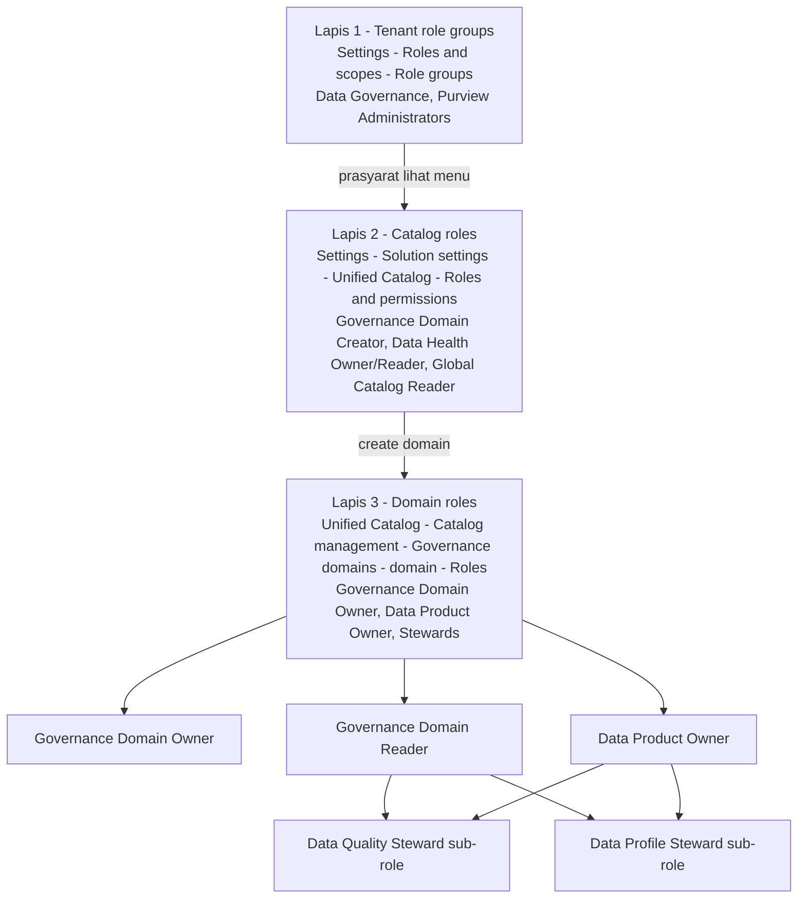

# Modul 01 – Setup Roles & Permissions di Purview

> **Tujuan:** Memastikan user demo memiliki izin yang sesuai untuk mengelola Data Quality di Microsoft Purview Unified Catalog (sesuai [MS Learn 04/2026](https://learn.microsoft.com/purview/data-governance-roles-permissions)).

⏱️ **Estimasi:** 10–15 menit · 🎯 **Output:** Akun demo bisa create governance domain + jalankan profiling/rules/DQ scan

---

## 📖 Penjelasan Singkat

Microsoft Purview pakai **3 lapis permission**:

| Lapis | Lokasi pengelolaan | Contoh role |
|-------|--------------------|-------------|
| **1. Tenant-level role groups** | Microsoft Purview portal → **Settings → Roles and scopes → Role groups** *(compliance portal embedded)* | **Data Governance**, Purview Administrators, Data Source Administrators |
| **2. Catalog-level roles** | **Settings → Solution settings → Unified Catalog → Roles and permissions** | Governance Domain Creator, Data Health Owner, Data Health Reader, Global Catalog Reader |
| **3. Governance domain–level roles** | **Unified Catalog → Catalog management → Governance domains → [domain] → Roles tab** | Governance Domain Owner, Data Product Owner, Data Steward, Data Quality Steward, Data Profile Steward, dll. |

> 🔑 **Kunci di UI baru:** Lapis 2 (catalog-level) **hanya muncul** kalau akun Anda sudah ada di role group **Data Governance** (lapis 1). Bila tidak, menu "Roles and permissions" di Settings → Unified Catalog **tidak akan kelihatan**.

> ⚠️ **Sub-role wajib digabung:** `Data Quality Steward` dan `Data Profile Steward` adalah **sub-role** — wajib digabungkan dengan **Governance Domain Reader + Data Product Owner** agar tombol *Profile*, *Rules*, dan *Run scan* aktif.

---

## 🧭 Hierarki & Flow Permission

---

## 🎭 Role yang Dibutuhkan untuk Demo DQ

| Role | Lapis | Untuk Apa | Wajib? |
|------|-------|-----------|--------|
| **Data Governance** *(role group)* | Tenant | Akses ke catalog-level role assignment, default Governance Domain Creator | ✅ untuk admin demo |
| **Governance Domain Owner** | Domain | Manage data product + assign role lain di domain | ✅ |
| **Data Product Owner** | Domain | Membuat data product, link assets | ✅ |
| **Governance Domain Reader** | Domain | Prasyarat sub-role steward & reader | ✅ |
| **Data Quality Steward** *(sub-role)* | Domain | Membuat & menjalankan rules + DQ scan | ✅ |
| **Data Profile Steward** *(sub-role)* | Domain | Menjalankan profiling job | ✅ |
| **Data Health Reader** | Catalog | Lihat dashboard Health Management | Opsional |
| **Data Quality Reader** *(sub-role)* | Domain | Audience read-only insight DQ | Opsional |

---

## 🚀 Langkah-langkah

### 1. Buka Purview Portal & Cek Account Type
1. Login ke [https://purview.microsoft.com](https://purview.microsoft.com).
2. Cek tenant aktif di avatar kanan atas.
3. Klik **Settings** (ikon gear di **left side-nav**, posisi bawah).
4. Buka **Account** → pastikan **Account type = Enterprise** dan **Resource status = Active**.
   > Bila Account type = *Free*, Unified Catalog/Data Quality **tidak tersedia**. Upgrade dulu (lihat [billing](https://learn.microsoft.com/purview/data-governance-billing)).
5. Catat **Location** resource — pastikan termasuk [supported region untuk Data Quality](https://learn.microsoft.com/purview/data-catalog-regions).

### 2. (Tenant level) Assign role group "Data Governance"
> Tanpa ini, menu *Roles and permissions* di Unified Catalog Settings **tidak akan muncul**. Lewati bila admin Anda sudah ada di role group ini.

1. Masih di **Settings**, di sidebar pilih **Roles and scopes → Role groups**.
2. Cari role group **Data Governance** → klik nama.
3. Pada panel detail, klik **Edit** di bagian **Members**.
4. Tambahkan user/group demo Anda → **Save**.
5. (Opsional, untuk admin senior) tambahkan juga ke **Purview Administrators** untuk full control.

> 💡 **Tip:** Role group "Data Governance" dikelola via **Microsoft Purview compliance portal** yang ter-embed di Settings. Propagasi dapat butuh **5–15 menit**.

### 3. (Catalog level) Assign Governance Domain Creator
> Lewati bila tenant Anda otomatis menjadikan member *Data Governance* sebagai domain creator (default behavior). Lakukan bila ingin meng-grant ke user lain.

1. Di **Settings** → bagian **Solution settings** → klik **Unified Catalog**.
2. Di halaman Unified Catalog Settings, pilih **Roles and permissions**.
3. Pilih role **Governance Domain Creator** → klik ikon **+ Add user**.
4. Cari user → **Save**.
5. (Opsional) ulangi untuk **Data Health Reader** / **Data Health Owner** bila user perlu akses Health Management lintas domain.

> 🔍 **Menu "Roles and permissions" tidak muncul?**
> Anda **belum** ada di role group **Data Governance** (lihat Step 2). Logout/login ulang setelah Step 2 lalu coba lagi.

### 4. Buka Unified Catalog & Buat Governance Domain
> Sebagai Governance Domain Creator, Anda otomatis menjadi Governance Domain Owner pada domain yang Anda buat.

1. Klik icon **Unified Catalog** di **left side-nav** (atau lewat **Solutions → Unified Catalog**).
2. Di sidebar Unified Catalog, pilih **Catalog management → Governance domains**.
3. Klik **+ New governance domain**.
4. Isi:
   - **Name:** `Sales`
   - **Description:** `Domain demo Data Quality – AdventureWorksLT`
   - **Type:** `Line of business`
   - **Parent domain:** *(none)*
5. Klik **Next** → (skip Custom attributes) → **Create**.
6. Buka domain `Sales` → klik **Edit** → ubah **Status = Published** → **Save**.

### 5. (Domain level) Assign Role di dalam Domain
1. Buka domain `Sales` → klik tab **Roles**.
2. Untuk **setiap role**, klik tombol **+** di samping nama role → cari user demo → **Save**:
   - ✅ **Governance Domain Owner** *(jika berbeda dari creator)*
   - ✅ **Data Product Owner**
   - ✅ **Governance Domain Reader** *(prasyarat sub-role)*
   - ✅ **Data Quality Steward** *(sub-role)*
   - ✅ **Data Profile Steward** *(sub-role)*
   - (Opsional) **Data Quality Reader** untuk audience read-only

### 6. Verifikasi
1. Logout & login ulang ke [https://purview.microsoft.com](https://purview.microsoft.com) (refresh token).
2. Klik **Unified Catalog** di left side-nav → **Health management → Data quality**.
3. Pastikan tombol **Manage**, **Profile**, dan **+ New rule** terlihat ketika navigasi ke asset.

---

## ⚠️ Hal yang Perlu Diperhatikan

| Item | Catatan |
|------|---------|
| Propagasi role | Butuh **5–15 menit** efektif — refresh atau re-login |
| Menu Unified Catalog di Settings | **Hanya muncul** bila Account type = Enterprise + tenant punya UC SKU aktif |
| Menu "Roles and permissions" | **Hanya muncul** bila login user ada di role group **Data Governance** |
| Sub-role tidak berdiri sendiri | DQ Steward / Profile Steward / Quality Reader **wajib digabung** dengan Governance Domain Reader + Data Product Owner |
| Group vs user | Untuk produksi pakai **Microsoft Entra Group** agar mudah dikelola |
| Tenant tanpa Unified Catalog | Bila Solutions hanya tampilkan **Data Catalog** classic, fitur Data Quality tidak tersedia — perlu enable Unified Catalog & DGPU billing |
| Least privilege | Berikan steward role hanya pada domain yang relevan |

---

## ✅ Checkpoint

- [ ] **Account type = Enterprise** & **Active** (Settings → Account)
- [ ] User admin sudah di role group **Data Governance** (Settings → Roles and scopes → Role groups)
- [ ] (Opsional) User demo punya **Governance Domain Creator** (Settings → Solution settings → Unified Catalog → Roles and permissions)
- [ ] Domain `Sales` sudah dibuat & **Published**
- [ ] User demo punya semua role wajib di tab **Roles** domain
- [ ] Bisa melihat **Health management → Data quality** dengan tombol Manage/Profile/+ New rule

---

## 🔗 Referensi

- [Roles & permissions for Microsoft Purview data governance](https://learn.microsoft.com/purview/data-governance-roles-permissions) *(updated 03/29/2026)*
- [How to assign catalog-level roles](https://learn.microsoft.com/purview/data-governance-roles-permissions#how-to-assign-catalog-level-roles)
- [How to assign governance domain roles](https://learn.microsoft.com/purview/data-governance-roles-permissions#how-to-assign-governance-domain-roles)
- [Create and manage governance domains](https://learn.microsoft.com/purview/unified-catalog-governance-domains-create-manage) *(updated 04/21/2026)*
- [Tenant-level role groups (Purview permissions)](https://learn.microsoft.com/purview/purview-permissions)

---

⬅️ [Modul 00](./00-provisioning-azure-sql.md) · ➡️ [Modul 02 – Microsoft Entra Auth & MSI](./02-configure-entra-auth-msi.md)
