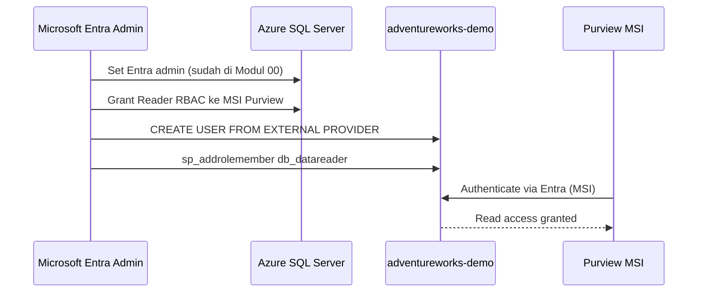

# Modul 02 – Konfigurasi Microsoft Entra Auth di Azure SQL & Akses MSI

> **Tujuan:** Memberi Microsoft Purview Managed Identity (MSI) izin untuk membaca metadata & data Azure SQL Database (`db_datareader`).

⏱️ **Estimasi:** 15 menit · 🎯 **Output:** Purview MSI menjadi user di database & memiliki akses read

---

## 📖 Penjelasan Singkat

Microsoft Purview menggunakan **Managed Identity (MSI)** sebagai cara aman untuk mengakses sumber data tanpa menyimpan password. Untuk Azure SQL:

1. **MSI Purview** harus dijadikan **Microsoft Entra user** di database.
2. **MSI** diberi role `db_datareader` agar bisa membaca metadata & melakukan profiling.
3. Untuk **Data Quality scan**, MSI adalah **satu-satunya credential yang didukung** untuk Azure SQL — SQL auth & service principal tidak diterima.

> 🔑 **Best practice keamanan:** MSI menghindari penyimpanan secret/password di Key Vault, dan otentikasi diatur sepenuhnya oleh Microsoft Entra ID.

---

## 🧭 Diagram



---

## 🚀 Langkah-langkah

### 2.1 Cek Nama Managed Identity Purview

1. Buka [Azure Portal](https://portal.azure.com) → masuk ke akun **Microsoft Purview**.
2. Tab **Properties** (atau **Overview**) → catat:
   - **Account name** (= nama SAMI, misal `purview-demo-prod`)
   - **Managed identity object ID** (untuk verifikasi RBAC)

> Bila menggunakan **User-Assigned Managed Identity (UAMI)**, buka tab **Managed identities** → catat nama UAMI.

### 2.2 Berikan Role `Reader` di Azure SQL Server (Azure RBAC)

1. Di Azure Portal → buka **SQL Server** (resource server, bukan database).
2. Menu kiri → **Access control (IAM)** → **+ Add → Add role assignment**.
3. Konfigurasi:
   - **Role**: `Reader`
   - **Assign access to**: **Managed identity**
   - **Members**: pilih **System-assigned managed identity** → pilih **Purview** → pilih akun Purview Anda
4. **Review + assign**.

> Role `Reader` di level Azure resource diperlukan agar Purview dapat **discover** server & databases. Akses ke data row-level diatur via T-SQL (langkah 2.3).

### 2.3 Buat User MSI di Database & Grant `db_datareader`

1. Connect ke **`adventureworks-demo`** sebagai **Microsoft Entra admin** menggunakan **SSMS** atau **Azure Data Studio**.
   - Authentication: **Microsoft Entra MFA / Password / Universal**
2. Pastikan database context = `adventureworks-demo`:
   ```sql
   USE adventureworks-demo;
   GO
   ```
   > Catatan: nama database dengan tanda hubung perlu dibungkus bracket: `USE [adventureworks-demo];`
3. Jalankan T-SQL berikut (ganti `[PurviewAccountName]` dengan nama akun Purview Anda):

```sql
-- Buat user yang merepresentasikan MSI Purview
CREATE USER [PurviewAccountName] FROM EXTERNAL PROVIDER;
GO

-- Berikan akses read
EXEC sp_addrolemember 'db_datareader', [PurviewAccountName];
GO
```

> Untuk **UAMI**, gunakan nama UAMI sebagai pengganti `[PurviewAccountName]`.

### 2.4 Verifikasi

```sql
-- Cek user terdaftar
SELECT name, type_desc, authentication_type_desc
FROM sys.database_principals
WHERE name = 'PurviewAccountName';

-- Cek role membership
SELECT r.name AS role_name, m.name AS member_name
FROM sys.database_role_members rm
JOIN sys.database_principals r ON rm.role_principal_id = r.principal_id
JOIN sys.database_principals m ON rm.member_principal_id = m.principal_id
WHERE m.name = 'PurviewAccountName';
```

Output yang diharapkan: 1 baris user dengan `type_desc = EXTERNAL_USER` dan role `db_datareader`.

---

## ⚠️ Hal yang Perlu Diperhatikan

| Item | Catatan |
|------|---------|
| Self-hosted IR | **Tidak mendukung** SAMI/UAMI untuk Azure SQL — harus pakai SQL auth/SP, tetapi DQ scan tetap **tidak bisa** |
| Private endpoint Purview | Bila Purview menggunakan private endpoint, MSI **tidak didukung** untuk registrasi sumber |
| Permission grant | Hanya **Microsoft Entra admin** SQL Server yang bisa menjalankan `CREATE USER ... FROM EXTERNAL PROVIDER` |
| Nama user MSI | Sama persis dengan nama akun Purview (case-sensitive di beberapa konteks) |

---

## ✅ Checkpoint

- [ ] MSI Purview punya role **Reader** di Azure SQL Server (RBAC)
- [ ] User `[PurviewAccountName]` ada di database `adventureworks-demo`
- [ ] User memiliki role `db_datareader`
- [ ] Verifikasi T-SQL menampilkan 1 baris

---

## 🔗 Referensi

- [Discover and govern Azure SQL Database in Microsoft Purview – Configure auth](https://learn.microsoft.com/purview/register-scan-azure-sql-database#configure-authentication-for-a-scan)
- [Grant Microsoft Purview permissions on the source](https://learn.microsoft.com/purview/unified-catalog-data-quality-supported-sources-connection#grant-microsoft-purview-permissions-on-the-source)
- [Configure Microsoft Entra authentication with Azure SQL](https://learn.microsoft.com/azure/azure-sql/database/authentication-aad-configure)
- [Create the service principal user in Azure SQL Database](https://learn.microsoft.com/azure/azure-sql/database/authentication-aad-service-principal-tutorial#create-the-service-principal-user-in-azure-sql-database)
- [Database-level roles](https://learn.microsoft.com/sql/relational-databases/security/authentication-access/database-level-roles)

---

⬅️ [Modul 01](./01-setup-roles-permissions.md) · ➡️ [Modul 03 – Register & Scan di Data Map](./03-register-scan-data-map.md)
