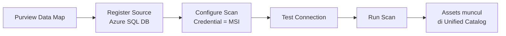

# Modul 03 – Register & Scan Azure SQL Database di Data Map

> **Tujuan:** Mendaftarkan Azure SQL Database ke Microsoft Purview Data Map dan menjalankan scan untuk meng-cataloging metadata.

⏱️ **Estimasi:** 15 menit · 🎯 **Output:** Asset `SalesLT.Customer`, `SalesLT.Product`, dll. tersedia di Unified Catalog

---

## 📖 Penjelasan Singkat

**Data Map** adalah komponen Purview yang menyimpan metadata seluruh data estate Anda. Sebelum sumber data bisa dipakai oleh **Unified Catalog** (untuk DQ, lineage, dan curation), Anda harus:
1. **Register** sumber data → memberitahu Purview tentang lokasi dan koneksi.
2. **Scan** sumber data → Purview membaca metadata (skema, tabel, kolom, sample classification) dan menyimpannya.

Hasil scan akan muncul sebagai **assets** yang bisa dikurasi ke dalam data product (Modul 04).

---

## 🧭 Diagram Alur

---

## 🚀 Langkah-langkah

### 3.1 Register Azure SQL Database

1. Buka [Microsoft Purview portal](https://purview.microsoft.com) → **Data Map** → **Sources**.
2. Klik **Register**.
3. Pilih tile **Azure SQL Database** → **Continue**.
4. Isi detail:
   - **Name**: `aw-sqldb-demo`
   - **Subscription**: pilih subscription Anda
   - **Server name**: `sqlsrv-purview-demo`
   - **Database name**: `adventureworks-demo` (atau biarkan kosong untuk semua DB)
   - **Select a collection**: pilih root atau collection target
5. Klik **Register**.

### 3.2 Buat Scan Baru

1. Pada source `aw-sqldb-demo` yang baru, klik ikon **New scan** ▶️.
2. Isi:
   - **Name**: `scan-aw-sqldb-once`
   - **Connect via integration runtime**: **Azure AutoResolveIntegrationRuntime** (default — managed)
   - **Credential**: pilih **Microsoft Purview MSI (system-assigned)**
     > Otorisasi sudah disiapkan di Modul 02
3. Klik **Test connection** → tunggu hingga **Success** ✅
4. Klik **Continue**.

### 3.3 Scope & Scan Rule Set

1. **Scope your scan**: pilih semua tabel `SalesLT.*` (atau biarkan seluruh database untuk demo).
2. **Select a scan rule set**: pilih **AzureSqlDatabase** (system default) — sudah berisi rule classification standar.
3. Klik **Continue**.

### 3.4 Scan Trigger

1. **Scan trigger**: pilih **Once** untuk demo.
2. **Save and run**.

### 3.5 Pantau Hasil

1. Setelah scan dijalankan, masuk ke source → tab **Scans** → buka scan yang berjalan.
2. Tunggu status berubah menjadi **Succeeded** (~3–5 menit untuk database kecil).
3. Lihat ringkasan: jumlah asset (tables) yang ter-discover.

### 3.6 Verifikasi di Unified Catalog

1. Buka **Unified Catalog** → search bar atas → ketik `SalesLT.Customer`.
2. Asset harus muncul dengan path: `aw-sqldb-demo / adventureworks-demo / SalesLT / Customer`.
3. Klik asset → tab **Schema** → harus menampilkan kolom: `CustomerID`, `FirstName`, `LastName`, `EmailAddress`, dll.

---

## 🔍 Apa yang di-Scan?

| Tipe Metadata | Contoh |
|---------------|--------|
| Schema | Tabel, view, kolom, tipe data |
| Classification | Auto-detect PII (email, phone) berdasarkan rule set |
| Sensitivity label | Bila tersambung ke Microsoft Purview Information Protection |
| Lineage (preview) | Stored procedure lineage untuk Azure SQL |

---

## ⚠️ Hal yang Perlu Diperhatikan

| Item | Catatan |
|------|---------|
| Test connection gagal | Cek RBAC `Reader` (Modul 02.2) & `db_datareader` (Modul 02.3); cek firewall *Allow Azure services = Yes* |
| Scan stuck "Queued" | Region IR mungkin sibuk; tunggu beberapa menit |
| Asset belum muncul | Refresh search index (~ 5 menit setelah scan succeeded) |
| Sample data classification | Purview membaca **sample rows** untuk classification — pastikan policy organisasi mengizinkan |

---

## ✅ Checkpoint

- [ ] Source `aw-sqldb-demo` ter-register
- [ ] Scan **Succeeded** dengan ≥ 4 asset
- [ ] Asset `SalesLT.Customer` ditemukan di Unified Catalog search
- [ ] Skema kolom muncul lengkap

---

## 🔗 Referensi

- [Discover and govern Azure SQL Database in Microsoft Purview](https://learn.microsoft.com/purview/register-scan-azure-sql-database)
- [Register a new source](https://learn.microsoft.com/purview/data-map-data-sources-register-manage#register-a-new-source)
- [Scan data sources](https://learn.microsoft.com/purview/data-map-scan-data-sources)
- [Create a scan rule set](https://learn.microsoft.com/purview/data-map-scan-rule-set)
- [Credentials for source authentication](https://learn.microsoft.com/purview/data-map-data-scan-credentials)

---

⬅️ [Modul 02](./02-configure-entra-auth-msi.md) · ➡️ [Modul 04 – Governance Domain & Data Product](./04-create-governance-domain-data-product.md)
