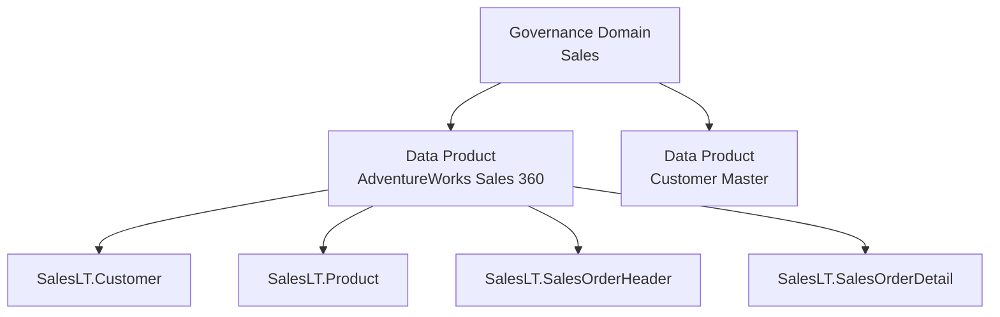

# Modul 04 – Create Governance Domain & Data Product

> **Tujuan:** Mengkurasi data assets ke dalam *Data Product* di bawah *Governance Domain* agar dapat di-govern.

⏱️ **Estimasi:** 10 menit · 🎯 **Output:** Data Product `AdventureWorks Sales 360` berisi 4 asset SalesLT

---

## 📖 Penjelasan Singkat

**Unified Catalog** memperkenalkan dua konsep penting:

| Konsep | Definisi |
|--------|----------|
| **Governance Domain** | Pengelompokan logis berdasarkan **bisnis** (misal `Sales`, `Finance`, `HR`) — bukan teknis |
| **Data Product** | Kumpulan terkurasi dari **data assets** yang dikemas untuk konsumsi (mirip "produk" yang ditawarkan tim data ke konsumer) |

Tanpa Data Product, Anda tidak bisa menjalankan **Data Quality scan** — karena scan dijalankan **per data product**, bukan per asset terpisah.

---

## 🧭 Hierarki

---

## 🚀 Langkah-langkah

### 4.1 Buat Governance Domain

1. Buka [Microsoft Purview portal](https://purview.microsoft.com) → **Unified Catalog** → **Governance domains**.
2. Klik **+ New governance domain**.
3. Isi:
   - **Name**: `Sales`
   - **Type**: pilih **Line of Business** (atau **Functional Unit** sesuai konteks)
   - **Description**: `Domain untuk semua produk data terkait penjualan`
   - **Owners**: tambahkan diri Anda
4. **Create** → status awal: **Draft**.
5. (Opsional) Klik **Publish** agar domain visible bagi user lain.

### 4.2 (Verifikasi) Role Anda

Pastikan Anda sudah jadi `Governance domain owner` di domain `Sales` (lihat **Modul 01**). Tanpa role ini, tombol **+ New data product** tidak muncul.

### 4.3 Buat Data Product

1. Masuk ke domain `Sales` → tab **Data products** → **+ New data product**.
2. Isi tab **Basics**:
   - **Name**: `AdventureWorks Sales 360`
   - **Type**: **Operational** (cocok untuk transactional data)
     > Tipe lain: **Master & reference**, **Analytical**, **Datasets**, **Source of supply**, **Operational**
   - **Description**: `Data produk yang menyajikan customer, product, dan order untuk analisis sales 360°`
   - **Owners** & **Domain experts**: tambahkan diri Anda
3. **Save as draft** → masuk ke detail data product.

### 4.4 Tambah Data Assets

1. Pada data product → tab **Data assets** → **+ Add data assets**.
2. Search: `SalesLT.Customer` → tambahkan.
3. Ulangi untuk:
   - `SalesLT.Product`
   - `SalesLT.SalesOrderHeader`
   - `SalesLT.SalesOrderDetail`
4. **Add**.

### 4.5 Publish Data Product

1. Lengkapi field minimum (Description, Owners, Use cases).
2. Klik **Publish** → status berubah menjadi **Published**.

> Tanpa publish, sebagian fitur DQ masih bisa digunakan, tetapi data product tidak akan muncul di marketplace untuk konsumer.

---

## 🎯 Konsep "Data Product Type"

| Type | Use Case Umum |
|------|---------------|
| **Operational** | Transactional system (CRM, ERP) — kasus AdventureWorks |
| **Master & reference** | Customer/Product master data |
| **Analytical** | Star/snowflake schema untuk BI |
| **Datasets** | Curated table/file untuk data scientist |
| **Source of supply** | Data dari supplier/partner |

---

## ⚠️ Hal yang Perlu Diperhatikan

| Item | Catatan |
|------|---------|
| Asset tidak ditemukan | Pastikan scan di **Modul 03** sudah Succeeded & ter-index |
| Data product Draft | Bisa untuk DQ scan internal; Publish saat siap di-share |
| Naming | Gunakan nama yang **business-friendly** (bukan teknis) |
| Critical Data Elements (CDE) | Bisa di-tag pada kolom tertentu untuk fokus DQ |

---

## ✅ Checkpoint

- [ ] Governance domain `Sales` dibuat
- [ ] Data product `AdventureWorks Sales 360` dibuat
- [ ] 4 asset SalesLT ditambahkan
- [ ] Status data product: **Published** (atau minimal **Draft** dengan owner ter-set)

---

## 🔗 Referensi

- [Create and manage data products in Unified Catalog](https://learn.microsoft.com/purview/unified-catalog-data-products-create-manage)
- [Add and remove data assets to a data product](https://learn.microsoft.com/purview/unified-catalog-data-products-create-manage#add-and-remove-data-assets)
- [Create a governance domain](https://learn.microsoft.com/purview/concept-governance-domain)
- [Sample setup for data governance – publish data products](https://learn.microsoft.com/purview/section3-publish-data-products)

---

⬅️ [Modul 03](./03-register-scan-data-map.md) · ➡️ [Modul 05 – Setup DQ Connection](./05-setup-dq-connection.md)
