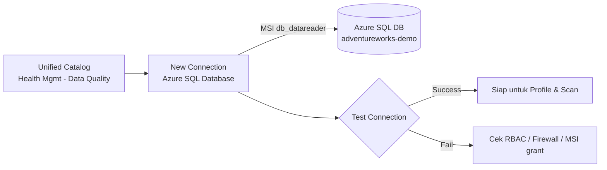

# Modul 05 – Setup Data Quality Connection ke Azure SQL DB

> **Tujuan:** Mengizinkan **Data Quality engine** (Apache Spark) Microsoft Purview membaca data fisik di Azure SQL Database untuk profiling & scanning.

⏱️ **Estimasi:** 10 menit · 🎯 **Output:** Connection `AdventureWorks Azure SQL DQ` aktif & Test = Success

---

## 📖 Penjelasan Singkat

**Data Map scan** (Modul 03) hanya membaca **metadata**. Untuk **profiling** dan **DQ scan**, Purview butuh akses **baca data row-level** menggunakan **DQ connection** terpisah, yang dikonfigurasi per **governance domain**.

DQ connection menggunakan **Apache Spark + JDBC** untuk membaca tabel SQL, dan **wajib menggunakan Microsoft Purview Managed Identity** sebagai credential — tidak bisa SQL auth atau service principal.

> 🔑 Inilah alasan **Modul 02** memberi `db_datareader` ke MSI Purview — credential ini dipakai oleh DQ engine.

---

## 🧭 Diagram

---

## 🚀 Langkah-langkah

### 5.1 Buka Halaman DQ Connections

1. Buka [Microsoft Purview portal](https://purview.microsoft.com) → **Unified Catalog**.
2. **Health management** → **Data quality**.
3. Pilih governance domain `Sales` (Modul 04).
4. Klik **Manage** (dropdown atas) → **Connections**.

### 5.2 Buat Connection Baru

1. Klik **+ New**.
2. Isi:
   - **Display name**: `AdventureWorks Azure SQL DQ`
   - **Description**: `DQ connection ke AdventureWorksLT`
   - **Source type**: **Azure SQL Database**
   - **Subscription**: pilih subscription Azure
   - **Server name**: `sqlsrv-purview-demo`
   - **Database name**: `adventureworks-demo`
   - **Credential**: **Microsoft Purview MSI** (system-assigned) — *satu-satunya pilihan untuk Azure SQL*

### 5.3 Test Connection

1. Klik **Test connection**.
2. Hasil yang diharapkan: ✅ **Success**.
3. Bila **Failed**, lihat tabel troubleshooting di bawah.

### 5.4 Submit

1. Klik **Submit** → connection muncul di list.
2. Status: **Connected**.

---

## 🔧 Troubleshooting Test Connection

| Pesan Error | Penyebab Umum | Solusi |
|-------------|---------------|--------|
| `Login failed for user '<token-identified principal>'` | MSI belum jadi user di DB | Re-run T-SQL `CREATE USER ... FROM EXTERNAL PROVIDER` di Modul 02.3 |
| `Cannot open server requested by the login. Client is not allowed to access` | Firewall block | Set **Allow Azure services and resources to access this server = Yes** di SQL Server networking |
| `The server principal is not able to access the database` | User MSI belum punya `db_datareader` | Run `EXEC sp_addrolemember 'db_datareader', '[PurviewAccountName]'` |
| `Authentication failed` | Region SQL/Purview tidak didukung DQ | Pindahkan resource ke [region yang didukung](https://learn.microsoft.com/purview/data-catalog-regions) |
| Timeout | Private endpoint / VNet | Aktifkan [Managed VNet Purview](https://learn.microsoft.com/purview/unified-catalog-data-quality-managed-virtual-networks) |

---

## ⚠️ Hal yang Perlu Diperhatikan

| Item | Catatan |
|------|---------|
| Read-only | DQ engine **tidak akan menulis** ke source — hanya `SELECT` |
| Data residency | Profiling summary disimpan di Microsoft Managed Storage, **region yang sama** dengan source |
| Performance | Profiling scan = full table read; pertimbangkan biaya DTU/vCore Azure SQL |
| Schema change | Bila skema tabel berubah, gunakan **Import schema** sebelum re-profile |

---

## ✅ Checkpoint

- [ ] Connection `AdventureWorks Azure SQL DQ` ada di list
- [ ] **Test connection = Success**
- [ ] Status: **Connected**

---

## 🔗 Referensi

- [Set up data source connection for data quality in Unified Catalog](https://learn.microsoft.com/purview/unified-catalog-data-quality-supported-sources-connection)
- [Supported sources & file formats for DQ](https://learn.microsoft.com/purview/unified-catalog-data-quality-supported-sources-file-formats)
- [Managed virtual network for DQ](https://learn.microsoft.com/purview/unified-catalog-data-quality-managed-virtual-networks)

---

⬅️ [Modul 04](./04-create-governance-domain-data-product.md) · ➡️ [Modul 06 – Run Data Profiling](./06-run-data-profiling.md)
