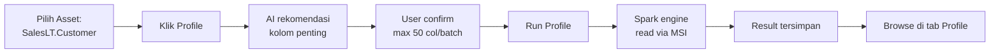

# Modul 06 – Run Data Profiling

> **Tujuan:** Memahami statistik & distribusi data tiap kolom sebelum membuat rules.

⏱️ **Estimasi:** 15 menit · 🎯 **Output:** Profile results untuk kolom kunci di `SalesLT.Customer` dan `SalesLT.Product`

---

## 📖 Penjelasan Singkat

**Data Profiling** adalah proses membaca seluruh data dan menghitung statistik per kolom:
- **Min, Max, Mean, Standard Deviation**
- **Distribution** (histogram nilai)
- **Completeness** (% non-null)
- **Uniqueness** (% nilai distinct)
- **Duplicate count**
- **Sample values**

Profiling membantu Anda **memahami data** sebelum menetapkan rules. Misalnya, sebelum membuat rule "Email tidak null", Anda perlu tahu: berapa % yang sekarang null?

> 💡 Purview punya **AI recommendation** yang menyarankan kolom mana yang patut di-profile, agar Anda tidak buang biaya pada kolom dengan nilai unik (misal PK/timestamp) atau highly sensitive.

---

## 🧭 Diagram Alur

---

## 🚀 Langkah-langkah

### 6.1 Navigasi ke Asset

1. Buka [Purview portal](https://purview.microsoft.com) → **Unified Catalog**.
2. **Health management** → **Data quality** → pilih `Sales` → pilih `AdventureWorks Sales 360`.
3. Pilih asset `SalesLT.Customer`.

### 6.2 Mulai Profiling

1. Pada halaman asset, tab **Overview** → klik tombol **Profile**.
2. Halaman **Profile configuration** terbuka.

### 6.3 Pilih Kolom

1. AI engine sudah pre-select kolom yang **disarankan**.
2. Untuk demo `SalesLT.Customer`, pilih kolom berikut:
   - ✅ `Title`
   - ✅ `FirstName`
   - ✅ `LastName`
   - ✅ `EmailAddress`
   - ✅ `Phone`
   - ✅ `CompanyName`
   - ❌ `CustomerID` (PK — distinct, tidak berguna untuk distribusi)
   - ❌ `rowguid`, `ModifiedDate` (metadata)

> ℹ️ Maks **50 kolom per batch**. Untuk asset > 50 kolom, jalankan profiling dalam beberapa batch.

### 6.4 Run Profile

1. Klik **Run Profile**.
2. Job akan masuk antrian Spark.

### 6.5 Pantau Job

1. Health management → **Data quality** → **Monitoring** (atau halaman job monitor di domain).
2. Lihat status: *Queued → Running → Completed*.
3. Durasi tipikal untuk tabel kecil: **2–5 menit**.

### 6.6 Browse Hasil

1. Setelah selesai, kembali ke asset → tab **Profile**.
2. Anda akan melihat per kolom:
   - **Distribution chart** (histogram)
   - **Completeness %**
   - **Uniqueness %**
   - **Min, Max, Mean, Std Dev** (untuk numeric)
   - **Top values** (sample)
3. Identifikasi pola untuk mendukung pembuatan rules:

| Kolom | Insight Tipikal | Implikasi Rule |
|-------|----------------|----------------|
| `EmailAddress` | Completeness 100%, format `name@domain` | Rule: pattern email + not null |
| `Phone` | Completeness ~70%, format bervariasi | Rule: pattern + threshold longgar |
| `Title` | Completeness ~50% (banyak null) | Rule: optional / value list |
| `CompanyName` | Completeness 100% | Rule: not empty |

### 6.7 Profile Asset Lain

Ulangi untuk:
- `SalesLT.Product` — fokus: `ListPrice`, `StandardCost`, `Color`, `Size`
- `SalesLT.SalesOrderHeader` — fokus: `OrderDate`, `Status`, `TotalDue`
- `SalesLT.SalesOrderDetail` — fokus: `OrderQty`, `UnitPrice`, `LineTotal`

---

## ⚠️ Hal yang Perlu Diperhatikan

| Item | Catatan |
|------|---------|
| Schema change | Klik **Import schema** sebelum re-profile bila tabel berubah |
| Kolom unique | Hindari profiling pada PK / GUID — distribusi tidak bermakna |
| Sensitivity | Hindari kolom highly sensitive (KTP, password) tanpa kebijakan eksplisit |
| Cost | Profiling = full table read → pengaruhi vCore consumption Azure SQL |
| Re-profile | Jadwalkan ulang setelah perubahan signifikan pada data |

---

## ✅ Checkpoint

- [ ] Profile `SalesLT.Customer` selesai (Completed)
- [ ] Distribution chart muncul untuk minimal 5 kolom
- [ ] Profile asset lain (`SalesLT.Product`) selesai
- [ ] Anda memahami completeness/uniqueness baseline tiap kolom

---

## 🔗 Referensi

- [Configure and run data profiling for a data asset](https://learn.microsoft.com/purview/unified-catalog-data-quality-profiling)
- [Job monitoring](https://learn.microsoft.com/purview/unified-catalog-data-quality-job-monitor)
- [Supported sources & limits](https://learn.microsoft.com/purview/unified-catalog-data-quality-supported-sources-file-formats)

---

⬅️ [Modul 05](./05-setup-dq-connection.md) · ➡️ [Modul 07 – Create DQ Rules](./07-create-dq-rules.md)
