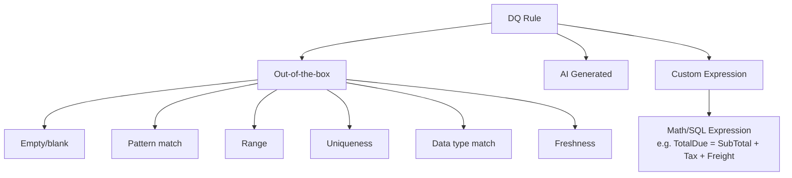

# Modul 07 – Create Data Quality Rules

> **Tujuan:** Mendefinisikan ekspektasi kualitas data berdasarkan hasil profiling.

⏱️ **Estimasi:** 20 menit · 🎯 **Output:** ≥10 rules tersebar di 4 asset SalesLT

---

## 📖 Penjelasan Singkat

**Data Quality Rule** = ekspektasi terukur tentang data Anda. Setiap rule menghasilkan **score 0–100** dan dipetakan ke salah satu dari **6 dimensi DQ**:

| Dimensi | Pertanyaan yang Dijawab |
|---------|--------------------------|
| **Accuracy** | Apakah data benar / sesuai realita? |
| **Completeness** | Apakah ada nilai yang hilang? |
| **Conformity** | Apakah data mengikuti format standar? |
| **Consistency** | Apakah ada kontradiksi antar field/record? |
| **Timeliness/Freshness** | Apakah data cukup baru? |
| **Uniqueness** | Apakah ada duplikasi? |

Purview menyediakan 3 cara membuat rule:
1. **Out-of-the-box (OOB)** — pre-built (Empty, Range, Pattern, Uniqueness, Freshness, Data type match)
2. **AI-generated** — Purview menyarankan rule berdasarkan profile
3. **Custom expression** — SQL/expression untuk logika kompleks

---

## 🧭 Klasifikasi Rule



---

## 📋 Rules untuk Demo AdventureWorksLT

| # | Asset | Kolom | Tipe Rule | Dimensi | Konfigurasi |
|---|-------|-------|-----------|---------|-------------|
| 1 | `SalesLT.Customer` | `EmailAddress` | Pattern (regex) | Conformity | `^[\w\.\-]+@[\w\.\-]+\.\w+$` |
| 2 | `SalesLT.Customer` | `EmailAddress` | Empty/blank | Completeness | Threshold ≥ 99% |
| 3 | `SalesLT.Customer` | `CustomerID` | Uniqueness | Uniqueness | Threshold = 100% |
| 4 | `SalesLT.Customer` | `Phone` | Pattern | Conformity | Format E.164 / regex; threshold ≥ 70% |
| 5 | `SalesLT.Product` | `ListPrice` | Range | Accuracy | `>= 0` |
| 6 | `SalesLT.Product` | `ListPrice` vs `StandardCost` | Custom | Accuracy | `ListPrice >= StandardCost` |
| 7 | `SalesLT.Product` | `ProductNumber` | Uniqueness | Uniqueness | Threshold = 100% |
| 8 | `SalesLT.Product` | `SellEndDate` | Custom | Consistency | `SellEndDate IS NULL OR SellEndDate >= SellStartDate` |
| 9 | `SalesLT.SalesOrderHeader` | `OrderDate` | Freshness (table) | Timeliness | Update ≤ 24 jam (akan FAIL → demo) |
| 10 | `SalesLT.SalesOrderHeader` | `TotalDue` | Custom | Consistency | `TotalDue = SubTotal + TaxAmt + Freight` |
| 11 | `SalesLT.SalesOrderDetail` | `OrderQty` | Range | Accuracy | `> 0` |
| 12 | `SalesLT.SalesOrderDetail` | `LineTotal` | Custom | Consistency | `LineTotal = OrderQty * UnitPrice * (1 - UnitPriceDiscount)` |

---

## 🚀 Langkah-langkah Membuat Rule

### 7.1 Contoh: Rule Pattern (EmailAddress)

1. Buka asset `SalesLT.Customer` → tab **Rules** → **+ New rule**.
2. Pilih jenis: **Pattern matching** (atau **Custom regex**).
3. Konfigurasi:
   - **Rule name**: `Customer Email Format Valid`
   - **Description**: `Email harus dalam format valid`
   - **Column**: `EmailAddress`
   - **Pattern (regex)**: `^[\w\.\-]+@[\w\.\-]+\.\w+$`
   - **Quality dimension**: **Conformity**
   - **Threshold**: `95%` (skor minimum agar rule dianggap pass)
4. **Create**.

### 7.2 Contoh: Rule Empty/Blank (Completeness)

1. **+ New rule** → **Empty/blank fields**.
2. Konfigurasi:
   - **Name**: `Customer Email Not Empty`
   - **Column**: `EmailAddress`
   - **Dimension**: **Completeness**
   - **Threshold**: `99%`
3. **Create**.

### 7.3 Contoh: Rule Uniqueness

1. **+ New rule** → **Uniqueness**.
2. Konfigurasi:
   - **Name**: `Customer ID Must Be Unique`
   - **Column**: `CustomerID`
   - **Dimension**: **Uniqueness**
   - **Threshold**: `100%`
3. **Create**.

### 7.4 Contoh: Rule Range

1. **+ New rule** → **Range**.
2. Konfigurasi:
   - **Name**: `Product ListPrice Non-Negative`
   - **Column**: `ListPrice`
   - **Min**: `0`, **Max**: tidak diisi (atau angka besar)
   - **Dimension**: **Accuracy**
3. **Create**.

### 7.5 Contoh: Rule Custom Expression

Untuk rule "TotalDue konsisten":

1. **+ New rule** → **Custom expression** (atau "Custom rule").
2. Konfigurasi:
   - **Name**: `TotalDue Consistency`
   - **Expression** (sintaks Spark SQL):
     ```sql
     ABS(TotalDue - (SubTotal + TaxAmt + Freight)) < 0.01
     ```
   - **Dimension**: **Consistency**
   - **Threshold**: `100%`
3. **Create**.

### 7.6 Contoh: AI-Generated Rule

1. Pada tab **Rules** → klik **AI suggestions** (jika tersedia).
2. Purview menampilkan saran berdasarkan profile (misal: "Kolom `EmailAddress` terlihat seperti email — buat pattern rule?").
3. Pilih saran → **Accept** → review → **Create**.

---

## 🔍 Best Practice Threshold

| Konteks | Threshold Saran |
|---------|-----------------|
| Primary Key / Critical | 100% |
| Nilai required | 95–99% |
| Format optional | 70–90% |
| Freshness SLA | sesuai SLA |

---

## ⚠️ Hal yang Perlu Diperhatikan

| Item | Catatan |
|------|---------|
| Threshold terlalu ketat | Banyak false-positive alerts → numb fatigue |
| Custom expression | Gunakan **Spark SQL syntax**, bukan T-SQL — `ABS`, `LENGTH`, `REGEXP_LIKE` |
| Update rule | Edit rule akan berlaku pada **scan berikutnya**, bukan retroaktif |
| Performa | Rule custom expression lebih mahal daripada OOB |

---

## ✅ Checkpoint

- [ ] Minimal 10 rules dibuat tersebar di 4 asset
- [ ] Setiap rule memiliki dimension yang sesuai
- [ ] Threshold ditetapkan sesuai kritikalitas
- [ ] Rule custom expression untuk `TotalDue` berhasil ter-create

---

## 🔗 Referensi

- [Create data quality rules](https://learn.microsoft.com/purview/unified-catalog-data-quality-rules)
- [Data quality dimensions overview](https://learn.microsoft.com/purview/unified-catalog-data-quality)
- [Custom expressions (Spark SQL)](https://learn.microsoft.com/purview/unified-catalog-data-quality-rules)

---

⬅️ [Modul 06](./06-run-data-profiling.md) · ➡️ [Modul 08 – Run DQ Scan](./08-run-dq-scan.md)
