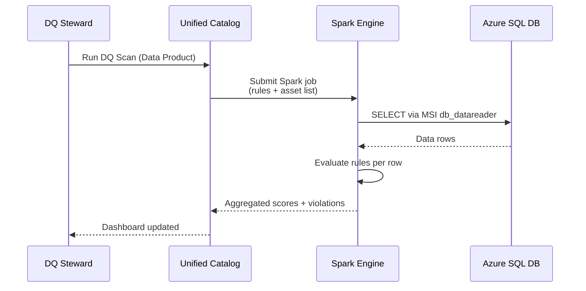
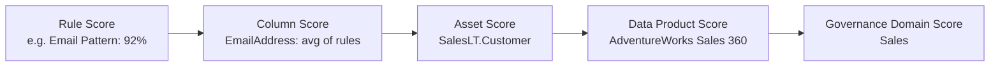

# Modul 08 – Run Data Quality Scan

> **Tujuan:** Mengeksekusi rules yang sudah dibuat terhadap data aktual untuk menghasilkan skor.

⏱️ **Estimasi:** 10 menit · 🎯 **Output:** DQ Scan job Completed dengan skor per asset

---

## 📖 Penjelasan Singkat

**DQ Scan** menjalankan semua rules yang ditetapkan pada **semua asset** dalam suatu **data product**, lalu:
1. Membaca data via MSI (`db_datareader`).
2. Mengevaluasi setiap rule menggunakan Spark SQL.
3. Menghasilkan **skor 0–100** per: rule → kolom → asset → data product → governance domain.
4. Menyimpan history untuk trend analysis.

Scan dapat dijalankan **on-demand** atau **terjadwal**.

---

## 🧭 Diagram Sequence

---

## 🚀 Langkah-langkah

### 8.1 Buka Data Product

1. [Purview portal](https://purview.microsoft.com) → **Unified Catalog** → **Health management** → **Data quality**.
2. Pilih `Sales` → pilih `AdventureWorks Sales 360`.

### 8.2 Run Scan

1. Klik tombol **Run data quality scan** (atas halaman).
2. Pilih asset & rules yang akan dievaluasi (default: semua).
3. Konfirmasi **Submit**.

### 8.3 (Opsional) Schedule Scan

Untuk demo, *Once* sudah cukup. Untuk produksi:

1. Pada data product → **Schedule** (icon kalender).
2. Pilih frekuensi:
   - **Hourly** — untuk data real-time
   - **Daily** — paling umum
   - **Weekly / Monthly** — untuk data slowly-changing
3. Set jam mulai & timezone.
4. **Save**.

### 8.4 Pantau Status

1. Health management → **Data quality** → **Monitoring**.
2. Filter status: *Active*, *Completed*, *Failed*.
3. Klik job untuk melihat detail (asset, rules, durasi, error log).

### 8.5 Verifikasi Hasil

Setelah Completed:
1. Kembali ke data product `AdventureWorks Sales 360`.
2. Halaman utama menampilkan **DQ score** keseluruhan.
3. Drill down ke asset → lihat skor per rule.

---

## 📊 Yang Dihitung dalam Scan

> Skor dihitung dengan **weighted average** dari level di bawahnya.

---

## ⚠️ Hal yang Perlu Diperhatikan

| Item | Catatan |
|------|---------|
| Job Failed | Cek log: biasanya credential issue, schema drift, atau Spark out of memory |
| Skor 0% pada Freshness | Normal untuk demo (sample 2008) → tunjukkan workflow remediation |
| Schedule overlap | Hindari scan yang berjalan paralel pada data source yang sama |
| Cost | Setiap scan = DGPU consumption (lihat pricing) |

---

## ✅ Checkpoint

- [ ] DQ scan job ter-submit
- [ ] Status Job: **Completed**
- [ ] Setiap asset menampilkan DQ score numerik (0–100)
- [ ] Tidak ada rule yang error (kecuali freshness 2008 — expected fail)

---

## 🔗 Referensi

- [Configure and run a data quality scan](https://learn.microsoft.com/purview/unified-catalog-data-quality-scan)
- [Job monitoring](https://learn.microsoft.com/purview/unified-catalog-data-quality-job-monitor)
- [Data quality scoring](https://learn.microsoft.com/purview/unified-catalog-data-quality-scores)

---

⬅️ [Modul 07](./07-create-dq-rules.md) · ➡️ [Modul 09 – Review DQ Scores](./09-review-dq-scores.md)
