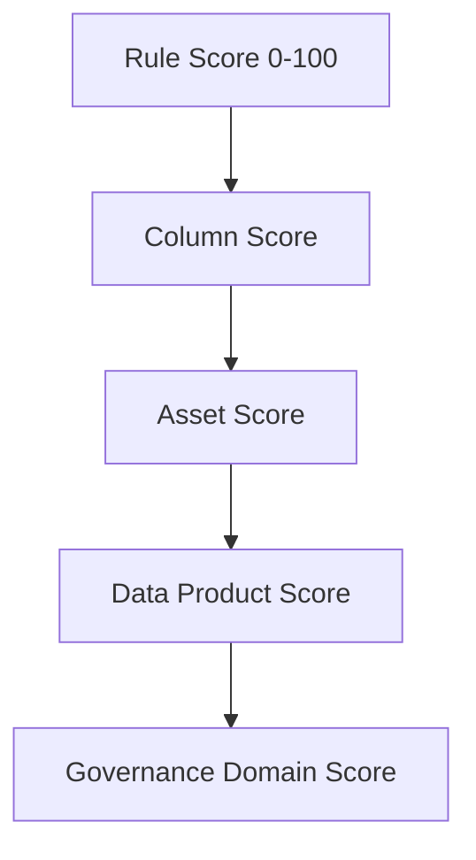
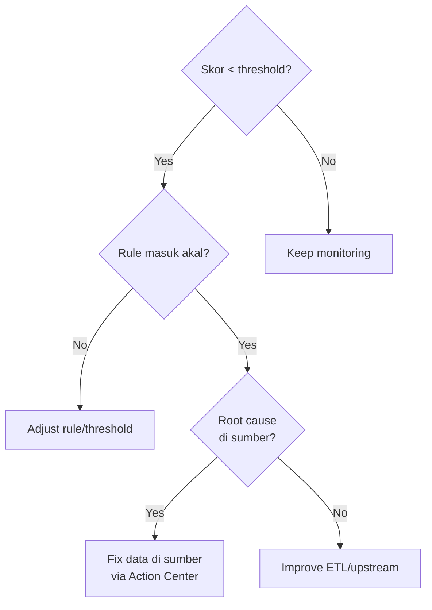

# Modul 09 – Review Data Quality Scores

> **Tujuan:** Membaca & menafsirkan skor kualitas data pada beberapa level agregasi untuk mengidentifikasi area perbaikan.

⏱️ **Estimasi:** 10 menit · 🎯 **Output:** Daftar kolom/rule yang underperform sebagai backlog remediation

---

## 📖 Penjelasan Singkat

Skor DQ adalah **weighted average** yang dihitung dari level granular ke agregat:

Setiap level menyimpan **history** sehingga Anda bisa melihat trend.

> 🎯 **Tujuan utama review:** *bukan* mengejar 100%, tapi **mengidentifikasi gap** yang harus diperbaiki di sumber.

---

## 🚀 Langkah-langkah

### 9.1 Lihat Score Governance Domain

1. [Purview portal](https://purview.microsoft.com) → **Unified Catalog** → **Health management** → **Data quality**.
2. Klik domain `Sales`.
3. Anda akan melihat **DQ score keseluruhan** (e.g. 82%).
4. Card menampilkan breakdown per dimensi (Completeness 95%, Accuracy 78%, dst).

### 9.2 Drill Down ke Data Product

1. Klik `AdventureWorks Sales 360`.
2. Lihat skor per asset:
   - `SalesLT.Customer` — 88%
   - `SalesLT.Product` — 91%
   - `SalesLT.SalesOrderHeader` — 75% (low karena freshness fail)
   - `SalesLT.SalesOrderDetail` — 95%

### 9.3 Drill Down ke Asset

1. Pilih asset bermasalah, mis. `SalesLT.SalesOrderHeader`.
2. Tab **Rules** → lihat rule mana yang skor rendah:
   - ❌ `OrderDate Freshness 24h` — 0%
   - ✅ `TotalDue Consistency` — 100%

### 9.4 Lihat Rule History

1. Klik salah satu rule → **Performance history**.
2. Chart menampilkan trend skor over time.
3. Identifikasi pola:
   - **Stabil tinggi** → rule sehat
   - **Stabil rendah** → masalah sistemik di sumber
   - **Drop tiba-tiba** → ada incident → root cause analysis

### 9.5 Export / Share

1. Klik **Export** untuk CSV / PNG dashboard.
2. Bagikan ke stakeholder data product owner.

---

## 📊 Contoh Tabel Score Review (untuk Demo)

| Asset | Rule | Score | Dimensi | Status | Action |
|-------|------|-------|---------|--------|--------|
| Customer | Email Format | 99% | Conformity | ✅ Pass | Monitor |
| Customer | Email Not Empty | 100% | Completeness | ✅ Pass | — |
| Customer | Phone Format | 68% | Conformity | ⚠️ Below threshold | Cleanse phone format |
| Product | ListPrice ≥ 0 | 100% | Accuracy | ✅ Pass | — |
| Product | ListPrice ≥ StandardCost | 95% | Accuracy | ✅ Pass | Investigate 5% |
| Order | Freshness 24h | 0% | Timeliness | ❌ Fail | Adjust threshold / fresh data |
| Order | TotalDue Consistency | 100% | Consistency | ✅ Pass | — |

---

## 🎯 Decision Framework

---

## ⚠️ Hal yang Perlu Diperhatikan

| Item | Catatan |
|------|---------|
| Score 0% pada freshness | Normal di demo (data 2008) — bukan bug |
| Aggregated score ≠ rata-rata simpel | Purview pakai weighted, kolom CDE dapat bobot lebih |
| History | Disimpan minimal **13 bulan** (untuk Historical Trend report) |

---

## ✅ Checkpoint

- [ ] Memahami DQ score domain `Sales`
- [ ] Drill down ke minimal 1 asset & 1 rule
- [ ] Identifikasi minimal 1 rule yang perlu remediation
- [ ] Memahami trend rule via performance history

---

## 🔗 Referensi

- [Data quality scoring](https://learn.microsoft.com/purview/unified-catalog-data-quality-scores)
- [Understand the quality report in Unified Catalog](https://learn.microsoft.com/purview/unified-catalog-reports-data-quality-health)

---

⬅️ [Modul 08](./08-run-dq-scan.md) · ➡️ [Modul 10 – Monitoring, Actions & Alerts](./10-monitoring-actions-alerts.md)
