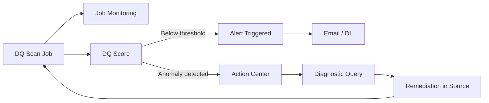

# Modul 10 – Monitoring, Actions & Alerts

> **Tujuan:** Mengaktifkan continuous monitoring, action workflow, dan notifikasi otomatis untuk DQ.

⏱️ **Estimasi:** 15 menit · 🎯 **Output:** Job monitoring aktif, 1 alert dikonfigurasi, paham Action Center

---

## 📖 Penjelasan Singkat

Setelah scan rutin berjalan, Anda butuh **mekanisme operasional** agar masalah kualitas data dapat ditangkap & diselesaikan tepat waktu:

| Kapabilitas | Fungsi |
|-------------|--------|
| **Job Monitoring** | Melihat status semua scan/profile job (Active/Completed/Failed) |
| **Action Center** | Daftar anomali kualitas data + diagnostic query untuk remediation |
| **Alerts** | Notifikasi email/distribution group ketika skor di bawah threshold |

---

## 🧭 Diagram Operasional



---

## A. Job Monitoring

### A.1 Buka Monitoring

1. [Purview portal](https://purview.microsoft.com) → **Unified Catalog** → **Health management** → **Data quality** → **Monitoring**.
2. Lihat list semua job dengan kolom:
   - Job ID
   - Type (Profile / Scan)
   - Status
   - Start/End time
   - Duration
   - Initiator

### A.2 Filter & Investigate

1. Filter status: **Failed** untuk fokus pada masalah.
2. Klik job → tab **Logs** untuk melihat error stack.
3. Common errors:
   - `Authentication failed` → cek MSI grant
   - `Schema mismatch` → re-import schema
   - `Spark OOM` → split asset / reduce columns

> Referensi: [Job monitoring](https://learn.microsoft.com/purview/unified-catalog-data-quality-job-monitor)

---

## B. Data Quality Actions

### B.1 Buka Action Center

1. Health management → **Data quality** → **Actions** (atau melalui notifikasi).
2. Anda melihat list anomali, masing-masing menunjukkan:
   - Asset & rule yang terdampak
   - Severity (High/Medium/Low)
   - Diagnostic query (auto-generated)

### B.2 Contoh Diagnostic

Untuk rule `Customer Email Format Valid` yang fail, Action Center bisa men-generate query untuk melihat baris bermasalah:

```sql
SELECT CustomerID, EmailAddress
FROM SalesLT.Customer
WHERE EmailAddress NOT LIKE '%_@__%.__%';
```

### B.3 Workflow

1. Steward review anomali.
2. Run diagnostic di SQL → identifikasi root cause.
3. Coordinate dengan owner data source untuk **fix di source** (bukan di Purview!).
4. Tutup action setelah scan ulang menunjukkan perbaikan.

> Referensi: [Data quality actions](https://learn.microsoft.com/purview/unified-catalog-data-quality-actions)

---

## C. Data Quality Alerts

### C.1 Buat Alert untuk Rule

1. Buka rule yang ingin di-monitor (mis. `Customer Email Format Valid`).
2. Tab **Alerts** → **+ New alert**.
3. Konfigurasi:
   - **Alert name**: `Customer Email Quality Drop`
   - **Trigger**: skor < `95%`
   - **Frequency**: setiap scan
   - **Recipients**: email pribadi atau distribution list
4. **Save**.

### C.2 Hasil yang Diharapkan

Saat scan berikutnya menemukan skor di bawah threshold:
- ✉️ Email otomatis dikirim ke recipient
- 🔔 Notifikasi muncul di portal
- 📊 Action otomatis dibuat di Action Center

### C.3 Alert untuk Multiple Rules

Anda bisa membuat **alert global** di level data product/governance domain:
- Trigger: `Data product score < 80%`
- Recipient: domain owner

> Referensi: [Data quality alerts](https://learn.microsoft.com/purview/unified-catalog-data-quality-alerts)

---

## 🎯 Demo Skenario

1. Set alert threshold rendah (mis. 99%) untuk rule yang sebelumnya 100%.
2. Modifikasi data sumber → insert 1 baris email invalid.
3. Re-run DQ scan.
4. Alert email muncul → buka Action Center → run diagnostic → identifikasi baris bermasalah.

---

## ⚠️ Hal yang Perlu Diperhatikan

| Item | Catatan |
|------|---------|
| Email frequency | Hindari spam; gunakan threshold realistic |
| Recipient | Gunakan **distribution list** Microsoft Entra agar mudah di-maintain |
| Action close | Status action tidak otomatis tertutup — perlu manual close setelah remediation |
| Monitoring retention | History job tersimpan terbatas; export bila perlu audit jangka panjang |

---

## ✅ Checkpoint

- [ ] Pernah membuka **Job Monitoring** & memfilter status
- [ ] Memahami **Action Center** & cara baca diagnostic
- [ ] Minimal 1 alert dibuat dengan threshold & recipient
- [ ] Memahami workflow remediation end-to-end

---

## 🔗 Referensi

- [Job monitoring](https://learn.microsoft.com/purview/unified-catalog-data-quality-job-monitor)
- [Data quality actions](https://learn.microsoft.com/purview/unified-catalog-data-quality-actions)
- [Data quality alerts](https://learn.microsoft.com/purview/unified-catalog-data-quality-alerts)

---

⬅️ [Modul 09](./09-review-dq-scores.md) · ➡️ [Modul 11 – Health Reports](./11-health-reports.md)
