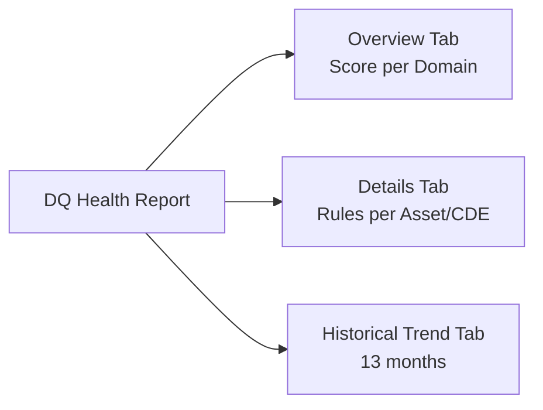

# Modul 11 – Data Quality Health Reports

> **Tujuan:** Memvisualisasikan tren kualitas data untuk komunikasi ke stakeholder & audit.

⏱️ **Estimasi:** 10 menit · 🎯 **Output:** DQ Health Report tampil dengan filter domain `Sales`

---

## 📖 Penjelasan Singkat

**DQ Health Report** menyediakan dashboard built-in di Unified Catalog untuk:
- 📈 Melihat skor agregat lintas domain
- 🔍 Drill-down detail per data product
- 📊 Historical trend hingga **13 bulan**
- 🏆 Top/bottom 10 assets

Report ini cocok untuk:
1. **Monitoring & governance** — health management berkelanjutan
2. **Decision support** — eksekutif & data owner
3. **Stakeholder communication** — laporan periodik
4. **Audit / regulatory** — bukti compliance

> ⚠️ **Prasyarat:** Anda perlu role **Data Health Reader** (Modul 01) untuk melihat report.

---

## 🧭 Konten Report

---

## 🚀 Langkah-langkah

### 11.1 Aktifkan Data Health Controls (Prasyarat)

> Report bergantung pada **data health controls** + **Unified Catalog metadata self-serve analytics**. Bila tidak diaktifkan, report **tidak refresh**.

1. Buka **Unified Catalog** → **Health management** → **Health controls**.
2. Pastikan minimal control terkait DQ aktif (mis. *Data quality scoring control*).

### 11.2 Buka DQ Health Report

1. **Unified Catalog** → **Health management** → **Reports**.
2. Pilih **DQ health** report.
3. Tunggu refresh awal (~1–5 menit pertama kali).

### 11.3 Tab Overview

- Card menampilkan:
  - DQ score per governance domain
  - Persentase asset di atas/di bawah threshold
  - Distribusi skor per dimensi
- Filter: **Governance domain**, **Data product**, **Time range**.

### 11.4 Tab Details

- Tabel detail menampilkan:
  - Jumlah rules per data product
  - Per asset: berapa rule pass/fail
  - Per CDE (Critical Data Element): kontribusi terhadap skor
- **Use case**: identifikasi data product yang under-performing.

### 11.5 Tab Historical Trend

- Chart timeline 13 bulan.
- Selector untuk **Top 10** / **Bottom 10** assets.
- Per dimensi (Completeness, Accuracy, dll.) — lihat improvement / degradation.

### 11.6 Filter & Bookmark

1. Filter berdasarkan domain `Sales` → data product `AdventureWorks Sales 360`.
2. Bookmark URL untuk akses cepat kembali.
3. Export PNG/PDF bila perlu untuk presentation.

---

## 📊 Contoh Use Case Report

| Audience | Tab yang Dipakai | Insight |
|----------|------------------|---------|
| Domain Owner | Overview + Details | Asset mana yang harus di-prioritise |
| Data Product Owner | Details | Rule mana yang sering gagal |
| Executive | Historical Trend | Apakah inisiatif DQ menunjukkan improvement? |
| Auditor | Historical Trend + export | Bukti continuous monitoring |

---

## ⚠️ Hal yang Perlu Diperhatikan

| Item | Catatan |
|------|---------|
| Report blank | Belum ada DQ scan yang Completed, atau data health controls belum aktif |
| Refresh delay | Report di-update setelah pipeline analytics berjalan (bisa beberapa jam) |
| Permission | User tanpa **Data Health Reader** akan kena access denied |
| Self-serve analytics subscription | Untuk report Unified Catalog, perlu subscription metadata self-serve |

---

## ✅ Checkpoint

- [ ] DQ Health Report bisa diakses
- [ ] Overview menampilkan skor domain `Sales`
- [ ] Details menampilkan asset & rule statistik
- [ ] Historical Trend chart muncul (mungkin 1 titik di awal demo)

---

## 🔗 Referensi

- [Understand the quality report in Unified Catalog](https://learn.microsoft.com/purview/unified-catalog-reports-data-quality-health)
- [Health management overview](https://learn.microsoft.com/purview/concept-data-governance-health-management)
- [Roles & permissions – Data Health Reader](https://learn.microsoft.com/purview/data-catalog-permissions#data-catalog-roles)

---

## 🎉 Selamat!

Anda telah menyelesaikan **seluruh tutorial series** Microsoft Purview Unified Catalog – Data Quality dengan studi kasus Azure SQL (AdventureWorksLT)!

### 📌 Next Steps Lanjutan

| Topik | Link |
|-------|------|
| DQ untuk Fabric Lakehouse | https://learn.microsoft.com/purview/unified-catalog-data-quality-fabric-lakehouse |
| DQ untuk Databricks Unity Catalog | https://learn.microsoft.com/purview/unified-catalog-data-quality-azure-databricks-unity-catalog |
| DQ untuk Snowflake | https://learn.microsoft.com/purview/unified-catalog-data-quality-snowflake |
| DQ untuk Synapse | https://learn.microsoft.com/purview/unified-catalog-data-quality-azure-synapse |
| Iceberg native support (preview) | https://learn.microsoft.com/purview/unified-catalog-data-quality-iceberg |
| DQ REST API otomasi | https://learn.microsoft.com/rest/api/purview/unified-catalog-data-quality |
| Managed VNet (private) | https://learn.microsoft.com/purview/unified-catalog-data-quality-managed-virtual-networks |

---

⬅️ [Modul 10](./10-monitoring-actions-alerts.md) · 🏠 [README](./README.md)
