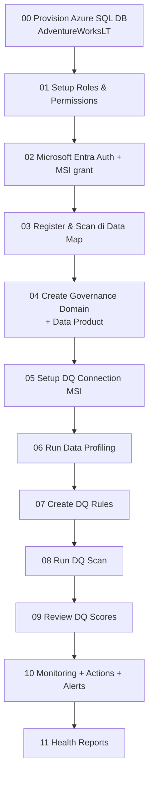
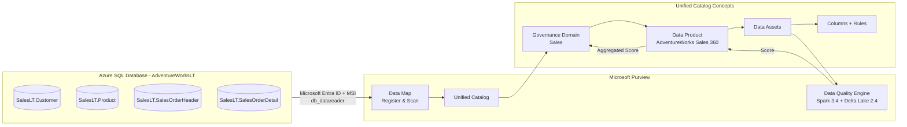

# Tutorial Series: Microsoft Purview Unified Catalog – Data Quality
## Studi Kasus: Azure SQL Database (AdventureWorksLT)

Selamat datang di tutorial series **end-to-end** untuk implementasi Data Quality di Microsoft Purview Unified Catalog menggunakan **Azure SQL Database** dengan sample **AdventureWorksLT**.

Tutorial ini disusun berdasarkan **dokumentasi resmi Microsoft Learn** dan dibagi menjadi modul kecil yang mudah diikuti.

---

## 📚 Daftar Modul

| Modul | Judul | Estimasi |
|-------|-------|----------|
| [00](./00-provisioning-azure-sql.md) | Provisioning Azure SQL Database (AdventureWorksLT) | 15 menit |
| [01](./01-setup-roles-permissions.md) | Setup Roles & Permissions di Purview | 10 menit |
| [02](./02-configure-entra-auth-msi.md) | Konfigurasi Microsoft Entra Auth & Akses MSI ke Azure SQL | 15 menit |
| [03](./03-register-scan-data-map.md) | Register & Scan Azure SQL Database di Data Map | 15 menit |
| [04](./04-create-governance-domain-data-product.md) | Create Governance Domain & Data Product | 10 menit |
| [05](./05-setup-dq-connection.md) | Setup Data Quality Connection ke Azure SQL DB | 10 menit |
| [06](./06-run-data-profiling.md) | Run Data Profiling | 15 menit |
| [07](./07-create-dq-rules.md) | Create Data Quality Rules | 20 menit |
| [08](./08-run-dq-scan.md) | Run Data Quality Scan | 10 menit |
| [09](./09-review-dq-scores.md) | Review Data Quality Scores | 10 menit |
| [10](./10-monitoring-actions-alerts.md) | Monitoring, Actions & Alerts | 15 menit |
| [11](./11-health-reports.md) | Data Quality Health Reports | 10 menit |

---

## 🎯 Tujuan

Setelah menyelesaikan series ini, Anda akan mampu:
- ✅ Menyiapkan environment Azure SQL DB sebagai data source untuk Purview
- ✅ Mengonfigurasi otentikasi Managed Identity yang aman antar layanan Azure
- ✅ Mengkurasi data assets ke dalam Governance Domain & Data Product
- ✅ Menjalankan profiling, membuat rules, dan menjalankan DQ scan
- ✅ Memantau kualitas data, memicu alert, dan membaca health report

---

## 🧭 Alur Visual

---

## 🏗️ Arsitektur Solusi

---

## 📋 Prasyarat Global

Sebelum mulai, pastikan Anda memiliki:

| Item | Keterangan |
|------|------------|
| Tenant **Microsoft Entra ID** | Akun dengan privilege admin yang cukup |
| **Microsoft Purview account** | Aktif di [region yang didukung Data Quality](https://learn.microsoft.com/purview/data-catalog-regions) |
| **Azure subscription** | Aktif untuk billing DGPU |
| **Owner / User Access Admin** | Pada subscription/RG untuk role assignment |
| **SSMS / Azure Data Studio** | Untuk grant akses MSI di SQL DB |

---

## 🔗 Referensi Resmi

- [Overview of data quality in Microsoft Purview Unified Catalog](https://learn.microsoft.com/purview/unified-catalog-data-quality)
- [Get started with Microsoft Purview data governance](https://learn.microsoft.com/purview/data-governance-get-started)
- [Sample setup for data governance](https://learn.microsoft.com/purview/data-governance-setup-sample)
- [Roles & permissions for Unified Catalog](https://learn.microsoft.com/purview/data-governance-roles-permissions)
- [Discover and govern Azure SQL Database](https://learn.microsoft.com/purview/register-scan-azure-sql-database)
- [Set up DQ source connection](https://learn.microsoft.com/purview/unified-catalog-data-quality-supported-sources-connection)

---

➡️ **Mulai dari** [Modul 00 – Provisioning Azure SQL Database](./00-provisioning-azure-sql.md)
